# 商旅 Agent Guide 总体设计

## 1. 文档说明

本文档基于当前仓库代码整理，描述 `travel-agent-guide` 的现状架构、核心流程、数据设计、部署方式、异常降级策略和后续演进方向。文档中的“当前实现”均可在现有代码中找到对应模块；“设计约束”和“演进建议”用于说明系统边界，不代表相关能力已经上线。

| 项目 | 内容 |
| --- | --- |
| 系统名称 | 商旅 Agent Guide |
| 系统类型 | 企业差旅 AI Agent 服务 |
| 主要语言 | Python 3.11+ |
| Web 框架 | FastAPI |
| Agent 编排 | LangGraph，支持 legacy 编排器回退 |
| 模型协议 | OpenAI-compatible Chat Completions / Embeddings |
| 核心存储 | Redis、Milvus；PostgreSQL 当前仅建立连接并用于健康检查 |
| 对外协议 | REST、SSE、MCP over HTTP JSON-RPC 2.0 |
| 文档版本 | 1.1 |
| 代码基线日期 | 2026-09-12 |
| Git 基线 | `origin/main@bc0d3af` |

## 2. 建设目标与范围

### 2.1 建设目标

系统面向企业员工、OA/费控系统和其他 Agent 平台，提供以下能力：

1. 以自然语言接收差旅需求，识别行程规划、库存查询、差标、预订和制度问答等意图。
2. 调用航班、酒店和 12306 火车票能力，生成可解释的候选方案；当工具轨迹包含 `mode=travel_recommendation` 的综合推荐结果时派生预订草稿。
3. 先形成结构化执行计划，再从知识库抽取制度约束，对舱位、预算、提前预订和审批条件进行校验，明确风险和人工审批要求。
4. 将企业制度文档向量化写入知识库，基于检索结果生成有引用的回答。
5. 保存短期会话和长期个人偏好，为多轮对话提供上下文。
6. 同时向 Web/API 客户端和 MCP 客户端开放能力。

### 2.2 当前系统边界

- 当前 LangGraph/MCP 在线链路只生成行程方案、候选比选结果和 `booking_draft`，不会自动下单或付款。只要工具轨迹包含 `mode=travel_recommendation` 的结果，就会尝试派生草稿；即使候选查询部分失败，草稿也可能字段不完整。
- `app/core/tools/booking.py` 中存在独立的本地预订领域函数，但尚未接入当前 LangGraph 或 MCP 在线工具链。该函数直接调用时会本地返回 `confirmed` 状态和确认号，因此“不会下单”仅适用于当前在线调用边界。
- 航班和酒店根据配置使用 Demo、Amadeus 或 FlyAI；Amadeus 需要同时配置 client ID 和 secret，否则回退到 Demo。火车票优先使用本地 12306 Skill，其次使用远程 MCP；两者均未配置时返回空结果，不生成演示车票。
- PostgreSQL 当前只创建异步连接池并执行健康探测，业务数据尚未写入 PostgreSQL。
- SSE 接口当前先完成整次 Agent 调用，再按字符回放结果，并非模型 token 或 Agent 事件的实时透传。
- Redis 或 Milvus 不可用时应用仍可启动。Redis 不可用会使会话历史、长期记忆、草稿持久化和会话管理接口不可用；Milvus 不可用会使文档接口返回 503，RAG 回退到无可靠引用的 `llm_fallback` 响应。

## 3. 系统上下文

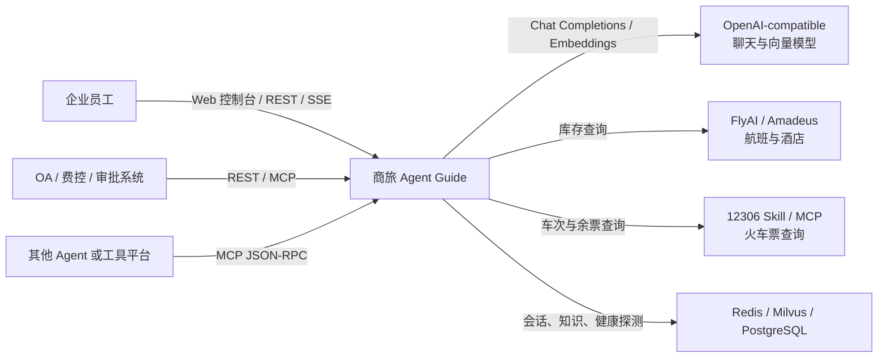

## 4. 总体架构

### 4.1 分层架构图

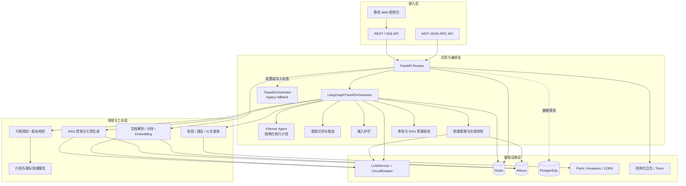

### 4.2 模块职责

| 层次 | 主要模块 | 职责 |
| --- | --- | --- |
| 应用入口 | `app/main.py` | 创建 FastAPI 应用，注册路由与静态资源，初始化 Redis、PostgreSQL、Milvus 和编排器 |
| API | `app/api/routes/` | 对话、会话、文档、健康检查和 MCP 接口；完成请求校验和响应 DTO 组装 |
| 主编排 | `app/agent/langgraph_orchestrator.py` | 定义 Agent 状态、Planner、动态路由、制度约束推理、RAG、合规校验、审批、核验、反思和最终持久化 |
| 兼容编排 | `app/agent/orchestrator.py` | 提供共享工具执行、会话记忆和 legacy ReAct 循环；也是 LangGraph 编排器的父类 |
| 通用 Agent 组件 | `app/core/agent/` | 提供独立的 Planner、ReAct、Reflection 等可复用实现；当前主链路主要使用 LangGraph 中的节点实现 |
| 意图识别 | `app/core/intent/` | 规则快车道和可选 LLM 慢车道；当前 LangGraph 默认实例只启用规则识别器 |
| 旅行工具 | `app/core/tools/travel_search.py` | provider 选择、航班/酒店/火车查询、并行综合推荐和结果归一化 |
| 领域模型 | `app/domain/travel/` | 差旅请求、行程、舱位、员工职级、差标规则和审批判断 |
| 文档 ETL | `app/etl/`、`app/services/document_loader.py` | 文档解析、语义分块、token 限制、稳定 chunk ID |
| 模型服务 | `app/services/llm.py`、`app/services/embeddings.py` | OpenAI-compatible 聊天与向量调用；聊天调用带熔断器 |
| 向量存储 | `app/services/milvus_store.py` | 集合初始化、COSINE 向量检索、知识写入、查询和删除 |
| 基础设施扩展 | `app/infrastructure/` | LLM 客户端、通用 Redis/PG/Milvus 封装及可观测性组件，部分尚未接入主链路 |
| 控制台 | `app/static/` | 对话、会话历史、知识库维护、RAG 测试和健康状态页面 |

## 5. Agent 编排设计

### 5.1 Agent 状态流转图

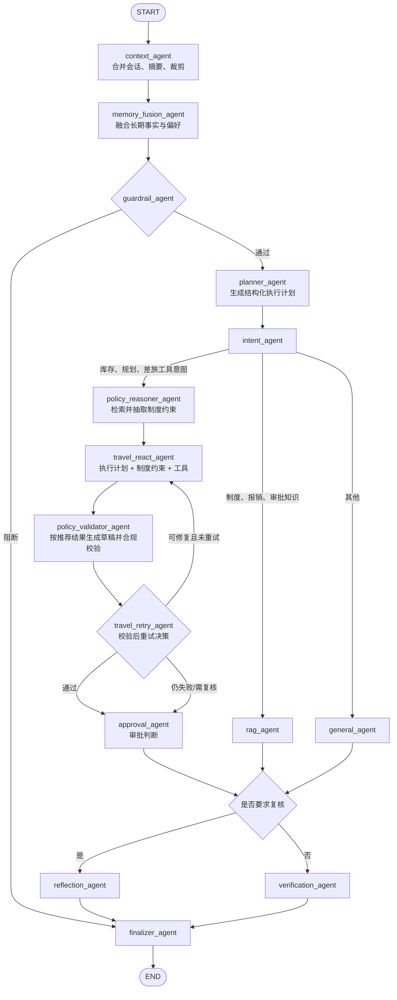

### 5.2 状态对象

`TravelGraphState` 是图中节点共享的工作状态，主要字段如下：

| 字段组 | 字段 | 用途 |
| --- | --- | --- |
| 输入 | `messages`、`session_id`、`user_id` | 原始对话与调用方标识 |
| 上下文 | `effective_messages`、`openai_messages` | 合并 Redis 历史、摘要并裁剪后的模型上下文 |
| 记忆 | `memory_context`、`long_term_memories`、`current_facts` | 当前事实、长期偏好和注入模型的优先级规则 |
| 路由 | `intent`、`route` | 意图和处理分支 |
| 规划 | `execution_plan` | Planner 输出的目标、槽位、工具清单、步骤和澄清要求 |
| 结果 | `answer`、`usage`、`response` | 文本答案、token 使用量和最终兼容响应 |
| 工具 | `tool_trace` | 工具名称、参数、原始输出和候选生成轮次 |
| 治理 | `policy_constraints`、`policy_validation`、`approval_form`、`booking_draft`、`risk_level` | 制度约束、合规检查、审批、预订草稿和风险等级 |
| 重试 | `travel_attempt`、`travel_retry_count`、`travel_retry_feedback`、`travel_retry_exhausted` | 当前候选轮次、重试次数、上一轮反馈和重试耗尽标记 |
| RAG | `citations`、`answer_mode`、`verification` | 引用、回答模式和事实核验结果 |
| 审计 | `trace`、`reflection_notes` | 节点执行轨迹与反思标记 |

### 5.3 节点说明

| 节点 | 输入重点 | 核心处理 | 输出/去向 |
| --- | --- | --- | --- |
| `context_agent` | 原始消息、session | 加载 Redis 会话；去重合并；长会话摘要；窗口裁剪 | 模型消息上下文 |
| `memory_fusion_agent` | 当前用户文本、user/session | 抽取职级、常驻地、偏好；合并长期记忆；注入优先级规则 | 护栏 |
| `guardrail_agent` | 用户文本 | 阻止绕过审批、伪造发票、提示注入；检查预订所需信息 | Planner 或直接结束 |
| `planner_agent` | 用户文本、记忆上下文 | 调用 LLM 生成 JSON 执行计划；解析失败时按关键词生成兜底计划 | 意图识别 |
| `intent_agent` | 用户文本 | 规则意图识别；库存/规划请求优先进入制度推理节点 | policy reasoner、RAG 或 general |
| `policy_reasoner_agent` | 用户文本、Milvus、记忆 | 检索制度资料；通过 LLM 与正则启发式抽取结构化约束 | 旅行 ReAct |
| `travel_react_agent` | 上下文、执行计划、制度约束、工具定义 | 将计划与约束注入模型；执行 function calling；追加 observation；最多 N 轮 | 合规校验 |
| `policy_validator_agent` | 制度约束、当前轮工具轨迹 | 仅在综合推荐结果存在时生成草稿；随后校验酒店限额、舱位、火车席别、审批阈值和提前预订天数 | 重试决策 |
| `travel_retry_agent` | 当前轮候选、合规结果、重试计数 | 在校验之后识别空候选、工具错误和可修复差标；最多回到 ReAct 重试一次，耗尽后提升风险并转人工审核 | 旅行 ReAct 或审批节点 |
| `rag_agent` | 问题、Milvus | 向量化、Top-K 检索、可靠性检查、基于引用回答 | 核验或反思 |
| `general_agent` | 模型上下文 | 不带工具的通用回答 | 核验或反思 |
| `approval_agent` | 工具轨迹、预订草稿 | 基于工具结果和草稿生成审批表，补充人工确认与审批提示 | 核验或反思 |
| `verification_agent` | 答案、引用、回答模式 | 仅对 `rag_grounded` 回答检查政策/金额等关键陈述是否有知识库依据；其他模式返回 `non_rag_answer` | 最终处理 |
| `reflection_agent` | 初稿 | 按日期、城市、金额、差标、审批风险进行质检和修订 | 最终处理 |
| `finalizer_agent` | 全部状态 | 强制企业输出契约；保存会话和草稿；组装元数据 | 最终响应 |

### 5.4 意图路由

意图枚举包括 `search_flight`、`search_hotel`、`search_train`、`trip_planning`、`application`、`policy`、`booking`、`info_query`、`rag` 和 `general`。

当前路由分为三个阶段：

1. 所有通过护栏的请求都先进入 Planner；Planner 的结果用于指导后续执行，但当前意图路由仍由规则识别和文本特征决定。
2. 文本同时包含“查询/推荐/规划”等动作词和航班、酒店、火车、行程等对象词时，优先进入 `policy_reasoner_agent`，即使规则分类结果是 `policy`。
3. 纯制度、差标、报销、审批类问题进入 `rag_agent`；其他旅行意图经 `policy_reasoner_agent` 后进入旅行工具节点；未命中的内容进入通用节点。

## 6. 核心业务时序

### 6.1 对话、工具调用与审批时序

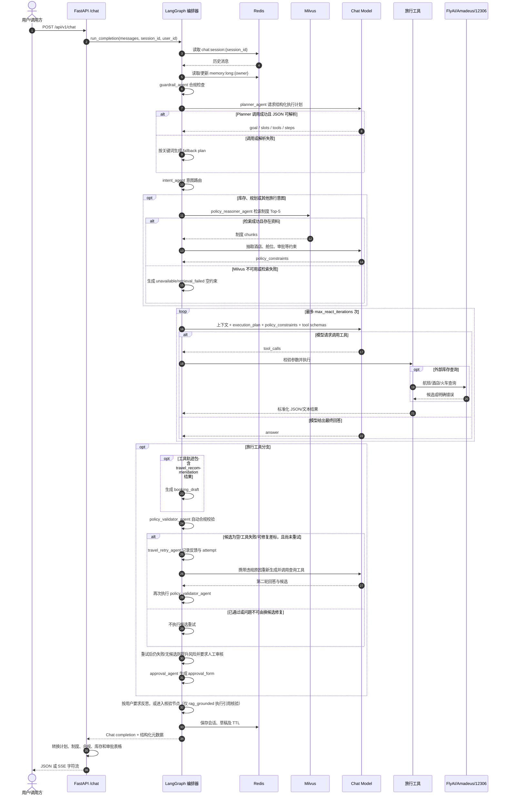

### 6.2 旅行计划与制度治理时序

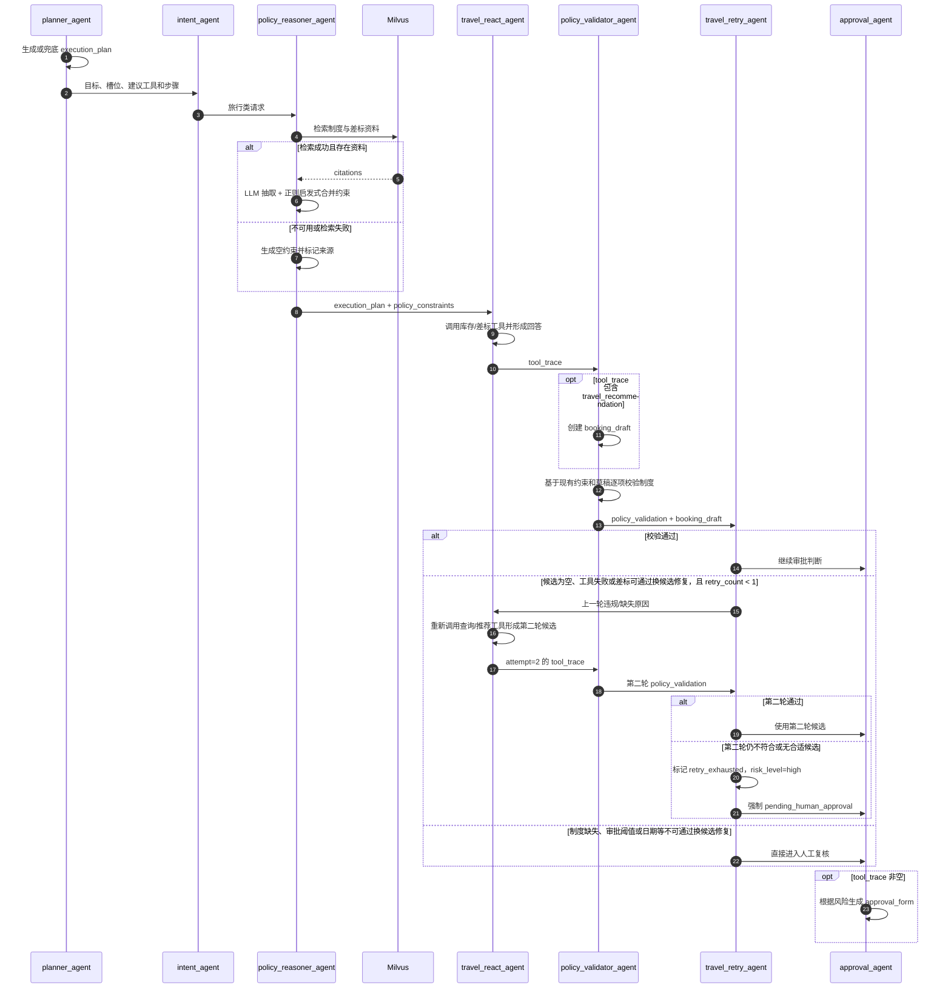

### 6.3 RAG 文档入库时序

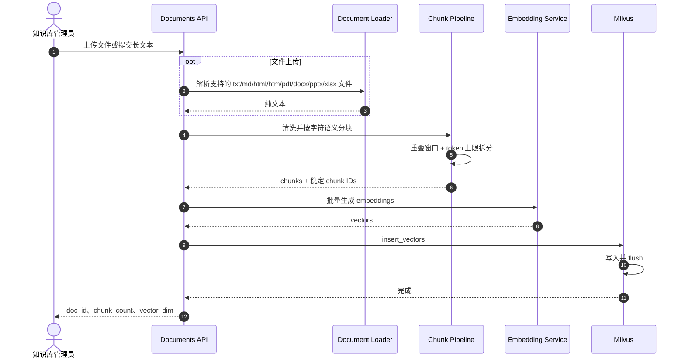

### 6.4 RAG 问答与降级时序

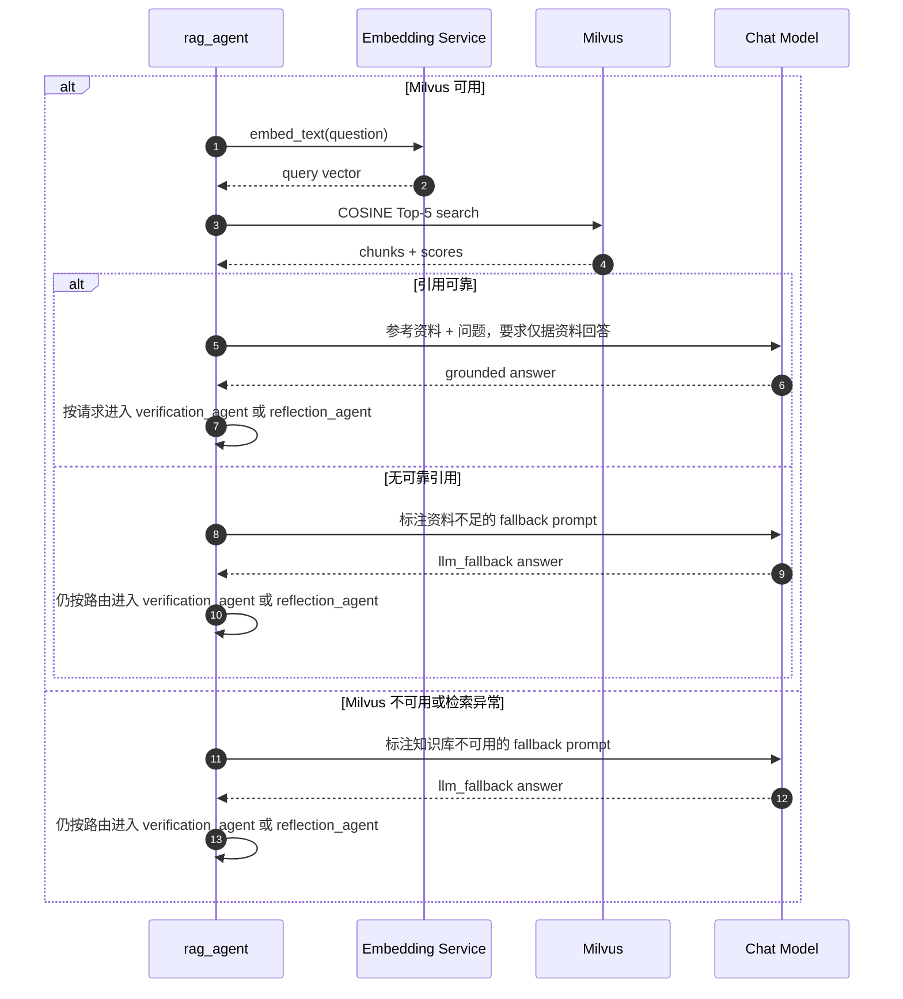

### 6.5 MCP 工具调用时序

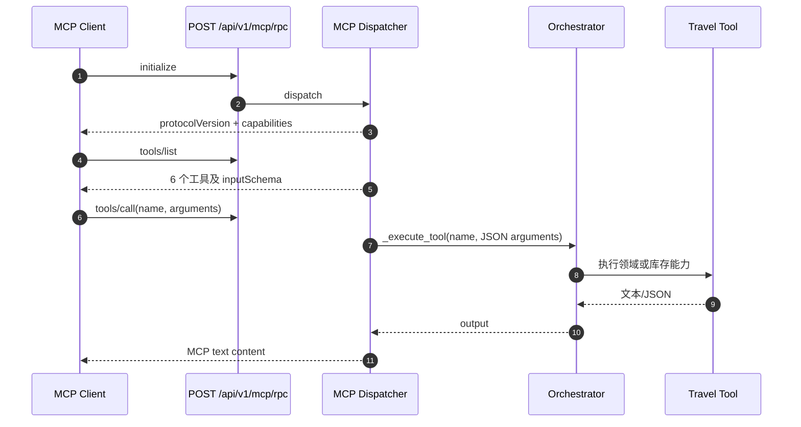

## 7. 工具与外部供应商设计

### 7.1 在线工具清单

| 工具 | 作用 | 主要依赖 |
| --- | --- | --- |
| `plan_travel_itinerary` | 基于结构化需求生成行程草稿和费用预估 | 本地领域模型 |
| `check_travel_policy` | 校验舱位、预算、提前预订和审批条件 | 本地差标规则 |
| `search_flights` | 查询航班候选 | demo / FlyAI / Amadeus |
| `search_hotels` | 查询酒店候选并支持预算、POI 过滤 | demo / FlyAI / Amadeus |
| `search_trains` | 查询高铁/火车候选和余票 | 本地 12306 Skill 或远程 MCP |
| `recommend_travel_options` | 并行查询航班、酒店和火车，排序后形成组合推荐 | 上述 provider |

`app/core/tools/booking.py` 虽然定义了 `create_booking`，但不在上述在线工具白名单和执行分发中；当前在线流程只使用推荐结果派生 `BookingDraft`。

### 7.2 Provider 选择

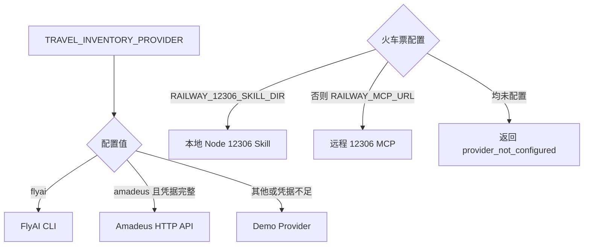

外部查询失败时，系统返回空候选、错误原因和免责声明，不会静默替换为伪造的实时数据。综合推荐通过 `asyncio.gather` 并行查询各类库存，再选取排序后的首选候选；只要返回 `travel_recommendation` 载荷，就会尝试生成草稿，候选为空时草稿中的推荐项可能为空。

## 8. 数据与存储设计

### 8.1 数据关系

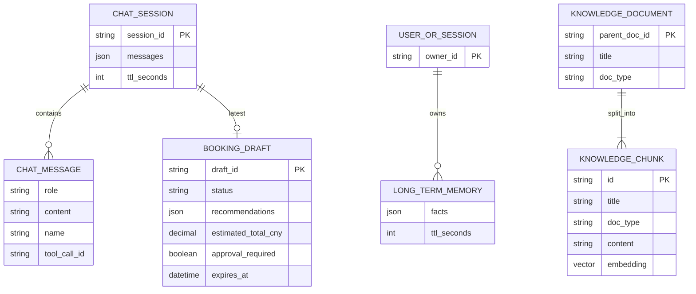

> 该图描述的是业务逻辑对象及其关系，并非当前 PostgreSQL 的物理表结构。当前会话、记忆和草稿以 Redis 键保存；知识内容以带重复元数据的 Milvus chunk 保存，尚未持久化独立的 `KNOWLEDGE_DOCUMENT` 业务实体。

### 8.2 Redis 键设计

| 键模式 | 内容 | TTL |
| --- | --- | --- |
| `chat:session:{session_id}` | 最近最多 `memory_max_messages` 条消息 | 默认 86,400 秒 |
| `memory:long:{user_id或session_id}` | 去重后的长期偏好/事实，最多 20 条 | 会话 TTL 的 30 倍 |
| `booking:draft:{draft_id}` | 完整预订草稿 JSON | 默认 86,400 秒 |
| `booking:session:{session_id}:latest` | 会话最近草稿 ID | 默认 86,400 秒 |

预订草稿对象自身的 `expires_at` 为创建后 30 分钟，它表示业务有效期；Redis 键 TTL 表示技术保留期，两者含义不同。

### 8.3 Milvus 集合设计

集合名称为 `travel_knowledge`：

| 字段 | 类型 | 说明 |
| --- | --- | --- |
| `id` | VARCHAR(64)，主键 | 单文档 ID 或 `chk_{parent_doc_id}_{hash}` |
| `title` | VARCHAR(512) | 文档标题 |
| `doc_type` | VARCHAR(32) | `policy`、`sop`、`city_guide` 或 `other` |
| `content` | VARCHAR(65535) | 文档或 chunk 正文 |
| `embedding` | FLOAT_VECTOR(1536) | 文本向量 |

索引使用 `IVF_FLAT`，距离度量为 `COSINE`，默认 `nlist=128`，检索时 `nprobe=16`。

### 8.4 关键领域对象

- `TravelRequest`：员工、职级、出发地、目的地、日期、目的和偏好舱位。
- `Itinerary`：行程段、预估总额和差标警告。
- `TravelPolicy`：职级舱位、城市酒店上限、日补贴、提前预订天数和事前审批金额线。
- `execution_plan`：Planner 生成的目标、结构化槽位、建议工具、缺失槽位、执行步骤、澄清标记和规划依据。
- `policy_constraints`：制度推理节点输出的来源、置信度、备注，以及酒店限额、提前预订、审批阈值、舱位和火车席别等约束。
- `policy_validation`：约束与草稿的逐项检查结果，状态为 `passed`、`needs_review` 或 `failed`，并分别记录通过项、警告和违规项。
- `ApprovalForm`：是否需要人工审批、风险原因和差标警告。
- `BookingDraft`：由工具轨迹中的 `travel_recommendation` 载荷派生，包含推荐交通/酒店、价格快照、确认项、下一步动作和有效期；上游候选失败时允许生成不完整草稿。
- `ChatResponse`：兼容 Chat Completions 的 `choices`，并扩展表格、引用、执行计划、制度约束、合规校验、审批、草稿、轨迹和风险字段。

## 9. API 设计

| 方法 | 路径 | 说明 | 关键失败条件 |
| --- | --- | --- | --- |
| GET | `/` | 服务入口、文档和控制台链接 | - |
| POST | `/api/v1/chat` | 非流式 JSON 或 SSE 对话 | LLM/编排异常 |
| GET | `/api/v1/health` | Redis、PostgreSQL、Milvus 健康状态 | 已初始化依赖探测失败时返回 degraded 内容 |
| GET | `/api/v1/sessions` | 扫描并列出会话 | Redis 不可用时 503 |
| GET | `/api/v1/sessions/{id}` | 查询会话历史 | Redis 不可用 503；不存在 404 |
| DELETE | `/api/v1/sessions/{id}` | 删除会话 | Redis 不可用时 503 |
| POST | `/api/v1/documents/ingest` | 单段文本入库 | Milvus 不可用 503 |
| POST | `/api/v1/documents/ingest-long` | 长文本分块入库 | 参数不合法 422；写入失败 500 |
| POST | `/api/v1/documents/upload` | 上传 txt/md/html/htm/pdf/docx/pptx/xlsx 并入库；Office 与网页格式优先使用 Unstructured | 格式不支持 415；解析失败 422 |
| GET | `/api/v1/documents` | 列出知识 chunk | Milvus 不可用 503 |
| GET | `/api/v1/documents/search` | 文本向量检索 | Milvus 不可用 503 |
| DELETE | `/api/v1/documents/{id}` | 按父文档或 chunk ID 删除 | Milvus 不可用 503 |
| POST | `/api/v1/documents/batch-delete` | 批量删除文档 | 任一删除异常时 500 |
| DELETE | `/api/v1/documents?title=...` | 按标题删除 | Milvus 不可用 503 |
| POST | `/api/v1/mcp/rpc` | MCP 初始化、工具、资源调用 | JSON-RPC error 响应 |

非流式 `/chat` 返回 OpenAI 风格基础结构，并增加：

- `tables`：从执行计划、制度约束、合规校验、行程文本、库存 JSON、Markdown 表格和预订草稿转换出的结构化表格。
- `citations`：RAG 命中的标题、类型、正文片段和相似度。
- `execution_plan`：Planner 的结构化计划；`planner` 字段标识来自 LLM 还是关键词兜底。
- `policy_constraints`：制度资料中抽取并合并后的结构化约束及其来源、置信度。
- `policy_validation`：自动合规校验状态、检查项、通过项、警告和违规项。
- `approval_form`、`booking_draft`：人工审批和预订确认数据。
- `trace`、`risk_level`、`answer_mode`、`verification`：解释、治理和核验信息。

Web 控制台在表格页展示计划、制度和合规结果，并在轨迹页以 JSON 展示 `execution_plan`、`policy_constraints` 和 `policy_validation`，同时保留节点级执行轨迹。

## 10. 部署架构

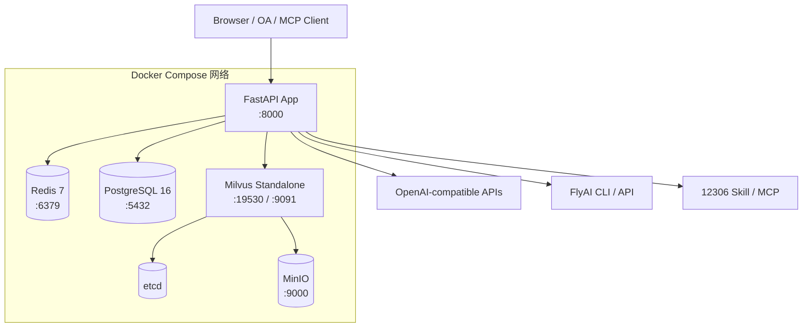

应用容器内安装 Python 依赖、Node.js、npm 和 `@fly-ai/flyai-cli`。`external/12306` 以可写目录挂载，FlyAI skill 以只读目录挂载。Docker Compose 会等待 PostgreSQL 和 Milvus 健康、Redis 启动后再创建应用容器；应用自身运行时对 Redis/Milvus 连接失败采取降级而不是退出。

### 10.1 启动与关闭

启动生命周期：

1. 配置结构化日志和 OpenTelemetry `TracerProvider`。
2. 尝试连接 Redis；失败时记录 warning 并将客户端置空。
3. 创建 PostgreSQL 异步连接池。
4. 连接 Milvus，并在需要时创建集合和索引。
5. 根据 `AGENT_ORCHESTRATOR_BACKEND` 创建 LangGraph 或 legacy 编排器。

关闭时释放 Redis 客户端和 PostgreSQL 连接池。Milvus 当前没有显式断开逻辑。

## 11. 非功能设计

### 11.1 可用性与降级

- Redis 失败：聊天仍可运行，但会话历史、长期记忆、草稿持久化及会话管理接口不可用。
- Milvus 失败：文档接口返回 503；RAG 对话改用明确标注的 `llm_fallback`，风险等级至少为 medium。
- PostgreSQL 失败：健康状态 degraded；当前聊天主流程不受影响。
- 外部库存失败：返回空结果、错误和免责声明，不伪造实时库存。
- 候选校验失败：对空候选、工具失败、酒店/舱位/席别等可修复问题携带校验反馈自动重试一次；第二次仍失败时停止自动尝试并强制人工审核。
- LangGraph 导入失败：启动时回退到 `TravelOrchestrator`。
- 聊天模型连续失败：`LLMService` 的 circuit breaker 根据阈值在 closed、open、half-open 状态间切换。
- ReAct 超限：返回“达到最大推理轮次”，避免无限工具循环。
- Planner 调用或 JSON 解析失败：使用受限工具白名单和关键词规则生成 `fallback` 执行计划，不中断后续意图路由。
- 制度推理检索失败：输出 `source=retrieval_failed` 的空约束；合规校验将结果标记为需要人工复核，而不是假定符合制度。

当前健康检查将未初始化的 Redis、PostgreSQL 客户端按可用处理；因此启动阶段连接失败未必会直接改变 `status`，这也是后续需要改进的已知边界。

### 11.2 一致性与幂等性

- 客户端重发完整历史时，编排器按首尾重叠消息去重，避免重复持久化。
- 长文档 chunk ID 由父文档 ID、序号和内容哈希稳定生成，同一输入可获得稳定标识。
- Milvus 写入后主动 `flush`，保证后续查询尽快可见。
- 当前文档批量入库不是事务操作，embedding 成功但 Milvus 部分写入失败时需要运维侧核查。

### 11.3 性能

- 会话上下文按消息数裁剪；超过阈值时先用 LLM 生成 200 字以内摘要。
- 所有通过护栏的请求都会调用一次 Planner LLM；旅行请求还可能增加制度约束抽取调用，候选校验失败时还会增加一次 ReAct 与供应商查询，因此相较 legacy 编排器具有额外延迟和 token 成本。
- 长文本先按语义单元和字符窗口分块，再执行 embedding token 上限保护。
- 综合旅行推荐并发查询航班、酒店和火车，减少总等待时间。
- Milvus 使用 IVF_FLAT 索引；数据规模增长后应通过评测调整 `nlist`、`nprobe` 和 Top-K。
- 当前 SSE 不降低首字节等待时间，若需要真正流式体验，应将模型流与工具事件直接转发给客户端。

### 11.4 安全与合规

当前已有控制：

- Pydantic 对 API 请求、工具参数和响应结构进行校验。
- 护栏阻止绕过审批、伪造发票和部分提示注入语句。
- Planner 只接受预定义的计划步骤标识，其输出会经过 JSON 解析、白名单过滤和结构归一化后再注入旅行节点。其中 `rag_policy_lookup` 是计划标签，由 `policy_reasoner_agent` 实现，并非 `_execute_tool()` 可直接调用的在线工具。
- 回答契约要求区分制度引用、工具数据、模型建议和人工待确认项。
- 制度约束只能从检索资料抽取；正则启发式仅识别受支持的酒店限额、提前天数、审批阈值、经济舱和二等座约束。
- 知识库依据不足时不宣称制度结论，并提高风险等级。
- 自动流程不会下单；综合推荐成功时只生成草稿，工具轨迹存在且涉及风险时输出 `pending_human_approval`。

生产部署前仍需补齐：

- API 身份认证、企业租户隔离和 RBAC。
- `session_id`、`user_id` 与当前身份的服务端绑定，防止越权读取会话或长期记忆。
- CORS 白名单；当前配置为全来源且允许 credentials，不适合直接暴露到公网。
- 上传大小限制、恶意文件检测、PII 脱敏、日志敏感字段过滤和数据保留策略。
- MCP 调用鉴权、调用方审计、工具级授权和速率限制。
- 供应商密钥使用 Secret Manager 管理，禁止使用示例密钥进入生产。

### 11.5 可观测性与质量

- 已配置结构化日志和基础 OpenTelemetry provider，Agent 状态中另有节点级 `trace`。
- 当前未配置 trace exporter、集中式指标后端和统一 request ID，需要在生产环境补充。
- 单元测试覆盖意图、编排路由、会话去重、Planner/制度/合规辅助逻辑、文档分块、MCP、RAG 和旅行搜索工具。
- `evals/build_rag_cases.py` 可从当前知识库生成候选问题与人工复核 CSV；`evals/apply_rag_review.py` 根据复核结果生成精选案例集。
- `evals/run_rag_eval.py` 支持多组 K 值以及仅检索模式，可计算 `hit@k`、`precision@k`、`recall@k`、MRR、检索平均/P95 延迟、关键词准确率和引用准确率。

## 12. 关键配置

| 配置组 | 代表变量 | 作用 |
| --- | --- | --- |
| Chat LLM | `OPENAI_API_KEY`、`OPENAI_BASE_URL`、`OPENAI_MODEL` | 对话、工具选择、摘要、反思 |
| Embedding | `EMBEDDING_API_KEY`、`EMBEDDING_BASE_URL`、`EMBEDDING_MODEL`、`EMBEDDING_DIMENSIONS` | 文档和查询向量化 |
| 存储 | `REDIS_URL`、`DATABASE_URL`、`MILVUS_HOST`、`MILVUS_PORT` | 会话、健康探测和知识库 |
| Agent | `AGENT_ORCHESTRATOR_BACKEND`、`MAX_REACT_ITERATIONS`、`TRAVEL_VALIDATION_MAX_RETRIES` | 编排后端、单轮 ReAct 循环上限和候选合规重试次数（默认 1） |
| 记忆 | `MEMORY_WINDOW_SIZE`、`MEMORY_SUMMARY_THRESHOLD`、`MEMORY_MAX_MESSAGES`、`MEMORY_SESSION_TTL_SECONDS` | 上下文窗口、摘要和持久化 |
| 航班酒店 | `TRAVEL_INVENTORY_PROVIDER`、`FLYAI_*`、`AMADEUS_*` | provider 与凭据 |
| 火车票 | `RAILWAY_12306_SKILL_DIR`、`RAILWAY_MCP_URL`、`RAILWAY_*_TIMEOUT_S` | 本地 Skill 或远程 MCP |
| 熔断 | `CIRCUIT_BREAKER_*` | 聊天模型故障隔离与恢复 |

注意：Milvus 集合当前固定为 1536 维，实际 embedding 模型输出维度必须与其一致。仅修改 `EMBEDDING_DIMENSIONS` 不会自动迁移已有集合。

## 13. 已知技术边界与演进建议

| 优先级 | 当前边界 | 建议 |
| --- | --- | --- |
| P0 | 无认证、租户隔离和权限模型 | 在公网或企业集成前加入 OIDC/JWT、RBAC、租户维度存储键和审计日志 |
| P0 | 预订草稿尚未形成受控状态机 | 建立 draft -> approved -> held -> confirmed/cancelled 状态机，所有外部副作用使用幂等键 |
| P1 | PostgreSQL 未承载业务数据 | 持久化审批、行程、预订、审计事件；Redis 只保留缓存和短期会话 |
| P1 | SSE 为完成后字符回放 | 设计 Agent 事件协议，实时发送模型 delta、tool_call、tool_result 和 done |
| P1 | 差标规则为代码内默认值 | 将政策版本化并按企业、职级、城市和生效日期管理；计算结果保留 policy_version |
| P1 | RAG 只使用单路向量检索 | 接入已有 `MultiChannelRetriever` 和 reranker，加入租户/doc_type 过滤及最低分阈值 |
| P1 | Planner 计划仅作为提示注入，未直接驱动确定性调度；当前只有候选合规校验具备一次有界重试 | 将步骤映射为可验证的执行 DAG，显式处理缺失槽位、依赖关系和跳过条件 |
| P1 | 制度约束抽取与校验规则覆盖有限 | 建立版本化约束 schema、单位归一化、城市/职级作用域和冲突解决策略 |
| P1 | 文档写入无事务和任务队列 | 对大文档采用异步任务、状态表、重试与补偿删除 |
| P2 | 部分 `app/core`、`app/infrastructure` 能力与在线链路重复 | 明确唯一编排、LLM、Milvus 抽象，逐步收敛重复实现 |
| P2 | 健康检查将未初始化客户端视为正常 | 区分 disabled、healthy、unhealthy，增加 readiness 与 liveness 两类探针 |
| P2 | 仅有进程内 TraceProvider | 配置 OTLP exporter、指标、日志关联和 SLO 告警 |

## 14. 代码导航

```text
app/
├── main.py                         # 应用工厂与生命周期
├── config.py                       # 环境配置
├── api/routes/                     # REST、SSE、MCP 接口
├── agent/
│   ├── langgraph_orchestrator.py   # 默认主编排图
│   └── orchestrator.py             # 共享能力与 legacy 编排器
├── core/
│   ├── agent/                      # 通用 Planner/ReAct/Reflection
│   ├── intent/                     # 快慢车道意图识别
│   ├── memory/                     # 通用记忆组件
│   ├── rag/                        # 多路检索、重排、生成组件
│   └── tools/                      # 工具注册、库存、MCP 客户端
├── domain/travel/                  # 行程和差标领域模型
├── etl/                            # 文档分块与入库管线
├── services/                       # 在线 LLM、Embedding、Milvus 实现
├── infrastructure/                 # 基础设施抽象与可观测性
└── static/                         # 管理与演示控制台

tests/                              # 单元和路由测试，含 Planner/制度/评测指标测试
evals/                              # RAG 案例生成、人工复核、精选集和在线评测
external/                           # 12306、FlyAI 外部能力包
docker-compose.yml                  # 本地完整依赖拓扑
Dockerfile                          # 应用镜像
```

## 15. 设计结论

当前系统以 FastAPI 为统一接入层、LangGraph 为默认决策与编排核心、本地领域规则和外部库存工具为行动层、Redis 与 Milvus 为记忆和知识层。其主要设计特点是：先融合上下文并生成结构化计划，再按意图分流；旅行分支先抽取制度约束，再执行库存工具和自动合规校验，对空候选、工具失败或可修复差标执行一次带反馈的候选重试，第二次仍失败则提升风险并转人工审核；在存在综合推荐结果时生成预订草稿及审批信息；只有 `rag_grounded` 回答会执行基于引用的关键事实核验，其他回答经过同一节点时以 `non_rag_answer` 跳过该核验；依赖故障时尽量显式降级而不是伪造结果。

要进入企业生产环境，下一阶段应优先完成身份与租户隔离、审批/预订持久化状态机、真正的流式事件协议、差标规则版本化以及完整的可观测性闭环。
