# 商旅 Agent Guide 总体设计

## 1. 文档说明

本文档基于当前仓库代码整理，描述 `travel-agent-guide` 的现状架构、核心流程、数据设计、部署方式、异常降级策略和后续演进方向。文档中的“当前实现”均可在现有代码中找到对应模块；“设计约束”和“演进建议”用于说明系统边界，不代表相关能力已经上线。

| 项目 | 内容 |
| --- | --- |
| 系统名称 | 商旅 Agent Guide |
| 系统类型 | 企业智能差旅服务 |
| 主要语言 | Python 3.11+ |
| Web 框架 | FastAPI |
| 工作流编排 | LangGraph，支持 legacy 编排器回退 |
| 模型协议 | OpenAI-compatible Chat Completions / Embeddings；百炼原生文本排序 API |
| 核心存储 | Redis、Milvus、关键词索引；PostgreSQL 当前仅建立连接并用于健康检查 |
| 对外协议 | REST、SSE、MCP over HTTP JSON-RPC 2.0 |
| 文档版本 | 1.8 |
| 代码基线日期 | 2026-10-09 |
| Git 基线 | `a741cb9`（代码提交；本次仅更新设计文档） |

## 2. 建设目标与范围

### 2.1 建设目标

系统面向企业员工、OA/费控系统和其他 Agent 平台，提供以下能力：

1. 以自然语言接收差旅需求，识别行程规划、库存查询、差标、预订和制度问答等意图。
2. 调用航班、酒店和 12306 火车票能力，生成可解释的候选方案；当工具轨迹包含 `mode=travel_recommendation` 的综合推荐结果时派生预订草稿。
3. 通过一次 LLM 调用联合完成意图识别与任务规划，输出符合 JSON Schema 的业务任务列表；校验后按任务数量进入单任务或多任务分支，按依赖调度，再对旅行结果执行制度与审批校验。
4. 为企业制度文档同时建立向量索引和关键词索引，采用双路召回、RRF 融合和检索后重排，每次默认返回 Top-5，按任务整理证据、进行程序计算和语义核验，必要时补充检索；不确定的制度问答转人工审核。
5. 保存短期会话和长期个人偏好，为多轮对话提供上下文。
6. 同时向 Web/API 客户端和 MCP 客户端开放能力。

### 2.2 当前系统边界

- 当前 LangGraph/MCP 在线链路只生成行程方案、候选比选结果和 `booking_draft`，不会自动下单或付款。只要工具轨迹包含 `mode=travel_recommendation` 的结果，就会尝试派生草稿；即使候选查询部分失败，草稿也可能字段不完整。
- `app/core/tools/booking.py` 中存在独立的本地预订领域函数，但尚未接入当前 LangGraph 或 MCP 在线工具链。该函数直接调用时会本地返回 `confirmed` 状态和确认号，因此“不会下单”仅适用于当前在线调用边界。
- 航班和酒店根据配置使用 Demo、Amadeus 或 FlyAI；Amadeus 需要同时配置 client ID 和 secret，否则回退到 Demo。火车票优先使用本地 12306 Skill，其次使用远程 MCP；两者均未配置时返回空结果，不生成演示车票。
- PostgreSQL 当前只创建异步连接池并执行健康探测，业务数据尚未写入 PostgreSQL。
- SSE 接口当前先完成整次工作流调用，再按字符回放结果，并非模型 token 或工作流事件的实时透传。
- 合并意图与任务规划、证据驱动问答和自动转人工属于 LangGraph 主链路；legacy 编排器仅作为兼容回退，不提供相同的多任务、证据核验和审核单生成保证。
- Redis、Milvus 或关键词索引不可用时应用仍可启动。Redis 不可用会使会话、记忆、草稿及审核持久化不可用；制度问答检索失败时直接返回受限的失败说明，不额外请求模型编造 fallback 答案，并尝试提交人工审核。审核存储失败明确标记 `review_submission_failed`。
- 制度问答审核与旅行 `approval_form` 是独立流程。当前审核使用内部单账号 Bearer 凭据，未接企业 SSO、多人账号或 OA 工作流；人工决定不会自动恢复被阻断的后续任务。

## 3. 系统上下文

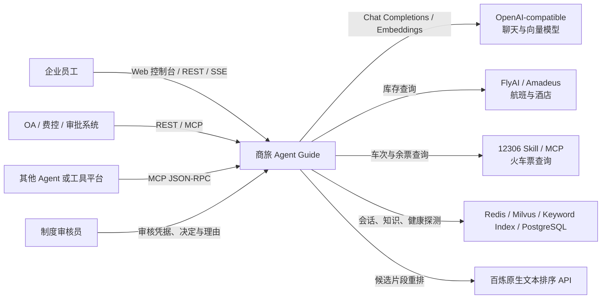

## 4. 总体架构

### 4.1 分层架构图

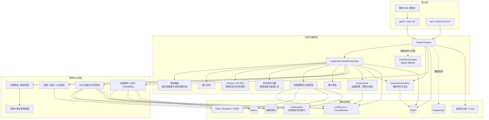

### 4.2 模块职责

| 层次 | 主要模块 | 职责 |
| --- | --- | --- |
| 应用入口 | `app/main.py` | 创建 FastAPI 应用，注册路由与静态资源，初始化 Redis、PostgreSQL、Milvus 和编排器 |
| API | `app/api/routes/` | 对话、会话、文档、健康检查、制度问答审核和 MCP 接口；完成校验、审核鉴权和响应 DTO 组装 |
| 主编排 | `app/agent/langgraph_orchestrator.py` | 定义工作流状态、合并意图与规划的 Planner、确定性路由、多任务依赖调度、旅行 ReAct Agent、制度治理、RAG 核验、复核和最终持久化 |
| 兼容编排 | `app/agent/orchestrator.py` | 提供共享工具执行、会话记忆和 legacy ReAct 循环；也是 LangGraph 编排器的父类 |
| 通用智能组件 | `app/core/agent/` | 提供独立的 Planner、ReAct、Reflection 等可复用实现；目录沿用历史命名，当前主链路只有旅行 ReAct 循环按本文口径称为 Agent |
| 通用意图识别 | `app/core/intent/` | 保留规则快车道和可选 LLM 慢车道的可复用组件；LangGraph 主链路由 Planner 统一识别意图，不再调用该规则识别器重新分类 |
| 旅行工具 | `app/core/tools/travel_search.py` | provider 选择、航班/酒店/火车查询、并行综合推荐和结果归一化 |
| 领域模型 | `app/domain/travel/` | 差旅请求、行程、舱位、员工职级、差标规则和审批判断 |
| 文档 ETL | `app/etl/`、`app/services/document_loader.py` | 多格式解析；PDF 条款聚合、Embedding 断点切分与表格行索引；其他格式使用结构边界分块及允许边界的 15% overlap；token 限制、稳定 chunk ID |
| 模型服务 | `app/services/llm.py`、`app/services/embeddings.py` | OpenAI-compatible 聊天与向量调用；聊天调用带熔断器 |
| 向量存储 | `app/services/milvus_store.py` | 集合初始化、COSINE 向量召回、知识写入、查询和删除 |
| RAG 检索与重排 | `app/core/rag/` | 关键词与向量双路召回、RRF 融合（`k=60`）、候选 Top-20、可选 API rerank 和默认 Top-5 输出 |
| 证据问答 | `app/services/evidence_qa.py`、`app/core/rag/evidence.py` | 需求与事实整理、受限 AST/Decimal 计算、结论草稿、语义与数值核验、有界修复和结构化诊断 |
| 制度问答审核 | `app/services/human_review.py`、`app/api/routes/human_reviews.py` | 识别转人工原因、保存审核单、校验审核凭据、原子提交决定及用户回执 |
| 基础设施扩展 | `app/infrastructure/` | LLM 客户端、通用 Redis/PG/Milvus 封装及可观测性组件，部分尚未接入主链路 |
| 控制台 | `app/static/` | 对话、会话历史、知识库维护、RAG 测试、健康状态、人工审核及用户回执页面 |

## 5. LangGraph 工作流设计

### 5.1 工作流状态图

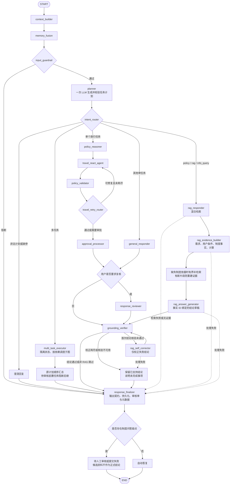

图中补检索、保留已支持结论和审核判断是节点内部处理，不是新增的 LangGraph 节点。子图通过 `_finish_task` 准备审核材料，由父图统一保存审核单；非 RAG 回复在核验节点记录 `status=skipped, passed=null`。

### 5.2 状态对象

`TravelGraphState` 是图中节点共享的工作状态，主要字段如下：

| 字段组 | 字段 | 用途 |
| --- | --- | --- |
| 输入 | `messages`、`session_id`、`user_id` | 原始对话与调用方标识 |
| 上下文 | `effective_messages`、`openai_messages` | 合并 Redis 历史、摘要并裁剪后的模型上下文 |
| 记忆 | `memory_context`、`long_term_memories`、`current_facts` | 当前事实、长期偏好和注入模型的优先级规则 |
| 路由 | `intent`、`route` | 主意图和处理分支；实际子任务按各自 `intent` 路由 |
| 规划 | `execution_plan` | 已校验的主意图、业务任务列表、各任务槽位与依赖、缺失参数和澄清问题 |
| 多任务 | `task_results` | 按计划顺序记录每个任务的状态、回答、引用、核验、工具轨迹和治理结果 |
| 结果 | `answer`、`usage`、`response` | 文本答案、token 使用量和最终兼容响应 |
| 工具 | `tool_trace` | 工具名称、参数、原始输出和候选生成轮次 |
| 治理 | `policy_constraints`、`policy_validation`、`approval_form`、`booking_draft`、`risk_level` | 制度约束、合规检查、审批、预订草稿和风险等级 |
| 重试 | `travel_attempt`、`travel_retry_count`、`travel_retry_feedback`、`travel_retry_exhausted` | 当前候选轮次、重试次数、上一轮反馈和重试耗尽标记 |
| RAG | `rag_question`、`rag_task_request`、`citations`、`rag_evidence`、`rag_draft`、`rag_stages`、`answer_mode`、`verification`、`claim_evidence_map`、`rag_correction_count` | 原问题与任务范围、证据包及程序事实记录、草稿、阶段诊断和核验 |
| 人工审核 | `human_review` | 内部审核准备对象，包含私有快照；最终持久化后仅公开审核摘要和用户回执凭据 |
| 审计 | `trace`、`reflection_notes` | 节点执行轨迹与反思标记 |

### 5.3 组件口径与节点说明

本文不把每个 LangGraph 节点都称为 Agent。判定标准如下：

- **Agent**：能够自主选择工具，消费工具 observation，并在有界循环中决定继续行动还是结束。当前在线主链路只有 `travel_react_agent` 满足该定义。
- **LLM 节点**：由图确定性调度，完成一次受限模型任务，不自主调度其他节点，包括 `planner`、`policy_reasoner`、`rag_evidence_builder`、`rag_answer_generator`、`rag_self_corrector`、`general_responder` 和 `response_reviewer`。`grounding_verifier` 同时使用模型语义核验和程序数值校验。
- **规则节点**：不依赖模型自主决策，执行输入检查、分类路由、合规校验、重试路由、审批表生成或引用核验。
- **基础设施节点**：负责上下文、记忆、持久化和响应组装。

| 节点 | 类型 | 输入重点 | 核心处理 | 输出/去向 |
| --- | --- | --- | --- | --- |
| `context_builder` | 基础设施节点 | 原始消息、session | 加载 Redis 会话；去重合并；长会话摘要；窗口裁剪 | 模型消息上下文 |
| `memory_fusion` | 基础设施节点 | 当前用户文本、user/session | 抽取职级、常驻地、偏好；合并长期记忆；注入优先级规则 | 护栏 |
| `input_guardrail` | 规则节点 | 用户文本 | 阻止绕过审批、伪造发票、提示注入；检查预订所需信息 | Planner 或直接结束 |
| `planner` | LLM 节点 | 用户文本、会话与记忆上下文 | 一次模型调用同时识别意图和拆分业务任务，输出 Schema 约束 JSON；本地校验任务枚举、参数、唯一 ID 和无环依赖 | 已校验计划或澄清结果 |
| `intent_router` | 规则节点 | 已校验 `execution_plan` | 根据 `len(tasks)` 判断单/多任务；单任务仅按任务 `intent` 路由；无效计划和缺参请求进入澄清 | policy reasoner、RAG、general、多任务执行器或最终处理 |
| `multi_task_executor` | 规则节点 | 任务列表与依赖 | 创建隔离子任务状态；有界并行执行就绪的只读任务；依赖任务等待前置结果；复用既有业务与核验节点，按原计划顺序汇总 | 统一最终处理 |
| `policy_reasoner` | LLM 节点 | 用户文本、混合检索、记忆 | 通过关键词与向量双路召回制度资料，RRF（`k=60`）融合并对候选 Top-20 进行 rerank，取最终 Top-5 后由 LLM 调用与正则启发式抽取结构化约束 | 旅行 ReAct Agent |
| `travel_react_agent` | Agent | 上下文、执行计划、制度约束、工具定义 | 将计划与约束注入模型；自主 function calling；追加 observation；最多 N 轮 | 合规校验 |
| `policy_validator` | 规则节点 | 制度约束、当前轮工具轨迹 | 仅在综合推荐结果存在时生成草稿；随后校验酒店限额、舱位、火车席别、审批阈值和提前预订天数 | 重试决策 |
| `travel_retry_router` | 规则节点 | 当前轮候选、合规结果、重试计数 | 在校验之后识别空候选、工具错误和可修复差标；默认最多回到 ReAct 重试一次，耗尽后提升风险并提示旅行人工审批 | 旅行 ReAct Agent 或审批节点 |
| `rag_responder` | 检索节点 | 原问题与任务描述 | 执行混合检索和可选 API 重排，记录引用及 retrieval 阶段；失败直接生成受限说明 | 证据整理或最终处理 |
| `rag_evidence_builder` | LLM + 程序校验 | 问题、任务范围和候选片段 | 整理需求、用户事实、制度事实及公式，校验引文和条件来源，程序计算；缺失制度证据时有界补检索并重建 | 草稿或最终处理 |
| `rag_answer_generator` | LLM + 程序校验 | 证据包和事实记录 | 生成独立结论并绑定事实/需求 ID，验证数值与覆盖，程序生成引用编号 | 核验或最终处理 |
| `general_responder` | LLM 节点 | 模型上下文 | 不带工具的单次通用回答 | 核验或复核 |
| `approval_processor` | 规则节点 | 工具轨迹、预订草稿 | 基于工具结果和草稿生成审批表，补充人工确认与审批提示 | 核验或复核 |
| `grounding_verifier` | LLM + 程序校验 | 原问题、草稿、事实及全部已取回片段 | 检查适用条件、例外、否定、版本、行列和推导；程序复核金额，分别记录结论支持性与问题完整性 | 最终处理、自校正或保留支持子集 |
| `rag_self_corrector` | LLM + 程序校验 | 原问题、草稿、失败结论和事实记录 | 最多校正一次，仅替换失败结论，保留通过部分；结构与业务错误共用一次修复，禁止新增事实和计算 | 重新核验或保留支持子集 |
| `response_reviewer` | LLM 节点 | 非 RAG 初稿 | 用户要求复核时质检；证据草稿不在此节点自由改写，交证据核验处理 | grounding verifier |
| `response_finalizer` | 基础设施节点 | 全部状态 | 强制输出契约；保存会话和草稿；将各任务准备的审核快照存入 Redis 一次，失败明确提示；组装元数据 | 最终响应 |

### 5.4 合并意图识别与任务规划

意图枚举包括 `search_flight`、`search_hotel`、`search_train`、`trip_planning`、`application`、`policy`、`booking`、`info_query`、`rag` 和 `general`。

所有通过输入护栏的请求都进入 `planner`。该节点使用一次 LLM 调用同时完成意图识别、任务拆分、参数抽取和依赖规划，模型返回符合 JSON Schema 的 JSON 数据。这里的“一次”只限定意图与规划阶段；会话摘要、RAG 回答、制度抽取及 ReAct 仍可能各自调用模型。

模型输出契约如下：

| 字段 | 约束与含义 |
| --- | --- |
| `primary_intent` | 必须与至少一个子任务意图一致，描述整个请求，供展示和审计；不覆盖子任务路由 |
| `tasks` | 1～8 个业务任务；任务数量由程序计算 |
| `tasks[].id` | 任务唯一标识，用于依赖和结果关联 |
| `tasks[].intent` | 当前任务的意图枚举，决定其业务分支 |
| `tasks[].request` | 完整、可独立理解的任务描述，保留用户约束 |
| `tasks[].slots` | 符合槽位 Schema 的结构化参数；严格输出要求列出所有槽位键，不适用或未知时为 `null`，不得编造 |
| `tasks[].depends_on` | 前置任务 ID 列表；引用必须存在，不得依赖自身或形成环 |
| `tasks[].missing_slots` | 缺失的必要参数名称 |
| `clarification_question` | 需要澄清的问题，无需澄清时为 `null` |

以“查询 2026 年 10 月 1 日北京到上海的航班，并说明公司报销流程”为例，任务结构如下。此处为便于阅读省略了值为 `null` 的槽位；实际严格结构化输出需包含 `TaskSlots` 定义的全部键。

```json
{
  "primary_intent": "search_flight",
  "tasks": [
    {
      "id": "task_1",
      "intent": "search_flight",
      "request": "查询2026年10月1日北京到上海的航班",
      "slots": {"origin": "北京", "destination": "上海", "depart_date": "2026-10-01"},
      "depends_on": [],
      "missing_slots": []
    },
    {
      "id": "task_2",
      "intent": "policy",
      "request": "查询公司差旅报销流程",
      "slots": {},
      "depends_on": [],
      "missing_slots": []
    }
  ],
  "clarification_question": null
}
```

默认使用模型接口的 `json_schema` 严格结构化输出。供应商不支持该能力时，可显式配置为 `json_object`；该模式仍执行相同的本地 Schema 与业务校验，不以“能解析 JSON”代替合法计划，也不在失败后自动追加第二次规划模型调用。

Schema 定义位于 `app/domain/task_plan.py`，与在线工具参数对齐：航班使用 `origin`、`destination`、`depart_date`，酒店使用 `city`、`check_in`、`check_out`，火车使用 `origin_station`、`dest_station`、`depart_date`，综合行程使用 `origin_city`、`destination_city`、`departure_date` 等。日期必须合法，金额和人数有类型及范围限制。

校验包括字段类型与额外字段、意图白名单、任务数量、任务 ID 长度、非空文本、槽位类型、唯一任务 ID、依赖引用和无环性。缺少关键参数、模型调用失败、空任务列表或非法计划均返回澄清，停止本次业务工具执行；不按关键词猜测计划，也不将复合请求静默缩减为一个任务。

### 5.5 单任务路由与多任务调度

`intent_router` 根据已校验的 `tasks` 数量确定分支，不再用动作词、业务名词或分类置信度推断自然语言是否包含多个任务，也不另调意图分类 LLM。

- 只有一个任务：旅行意图进入 `policy_reasoner → travel_react_agent`；知识类意图进入 `rag_responder`；其余意图进入 `general_responder`。
- 多于一个任务：进入 `multi_task_executor`，每个子任务按自己的 `intent` 复用相同业务分支。

任务粒度是能够独立交付结果的业务请求。“查航班并说明报销流程”是两个任务；“规划符合差标的出差方案”可以是一个 `trip_planning` 任务，内部包含制度检索和多个工具步骤。工具调用次数不能作为任务数量。

多任务执行器按依赖关系选取就绪任务。没有相互依赖的只读任务可以并行，默认并发上限为 3；依赖任务必须等前置任务成功后执行，并接收前置任务结果。涉及草稿或申请的业务任务顺序执行。默认规划超时为 30 秒；`policy`/`rag` 子任务使用 360 秒总超时，其他子任务（包括 `info_query`）使用 120 秒。证据模型每次请求默认最多 120 秒。每个任务有独立失败状态；前置任务失败时，其依赖任务标记为阻塞，不将未完成任务报告为成功，也不丢弃其他已完成结果。

每个子任务使用隔离状态，保存自身回答、工具轨迹、引用、合规结果及事实核验。子任务执行不重复调用 Planner、上下文初始化、记忆写入或最终持久化。RAG 回答在子任务范围完成事实核验及有界自校正；汇总节点按原计划顺序组装已核验回答和状态，不通过额外生成改写掩盖失败或改变引用。顶层统一完成会话及草稿持久化，并保留 `task_results` 以便 API 和控制台逐项展示。

任务状态为 `completed`、`needs_review`、`failed` 或 `blocked`，分别表示完成、需要复核、执行失败和前置条件未满足。制度问答存在审核材料、未完整回答或降级时不能视为完成；失败的 `policy`/`rag`/`info_query` 子任务会准备审核单，前置待审核任务的后继保持阻断。并非每个旅行 `needs_review` 都有制度问答审核单，旅行审批仍看 `approval_form`。多任务响应的顶层 `booking_draft`、`approval_form` 保持为空，各任务的草稿及审批结果保存在对应 `task_results` 条目中，避免不同任务的结果互相覆盖。

## 6. 核心业务时序

### 6.1 对话、工具调用与审批时序

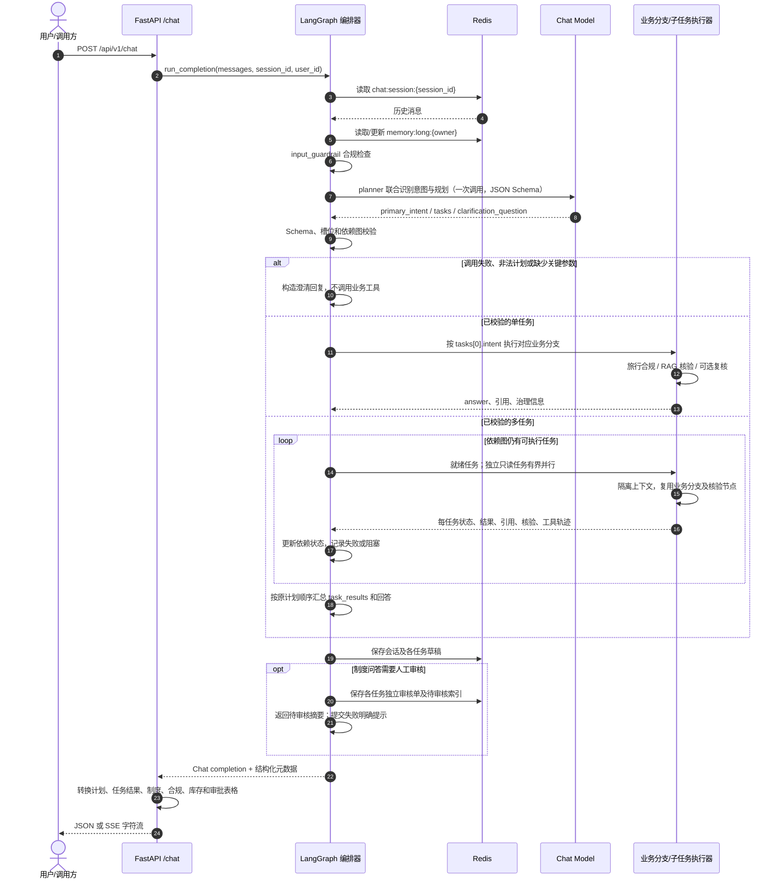

### 6.2 旅行计划与制度治理时序

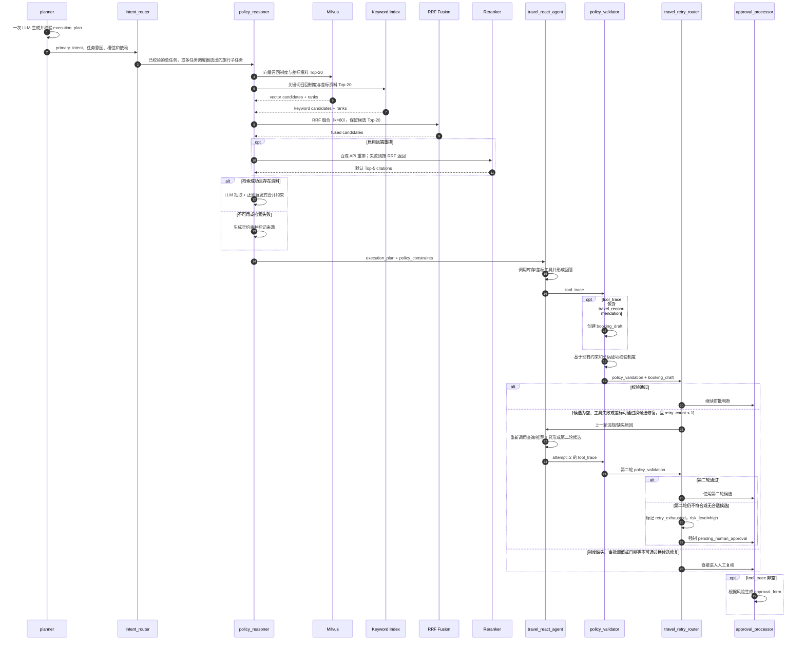

### 6.3 RAG 文档入库时序

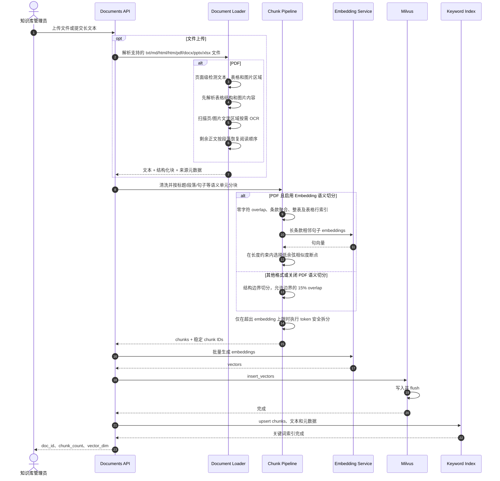

### 6.4 证据驱动问答与人工审核时序

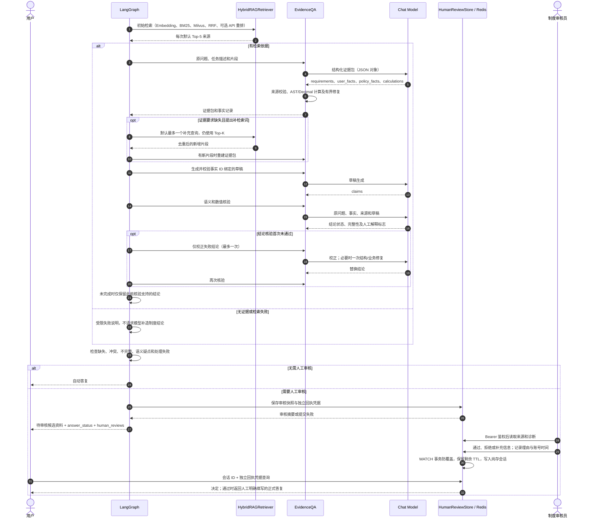

审核提交失败不等同于进入审核队列。审核后的补充信息需要用户重新提问；模型不改写人工正式答复，系统不自动继续已阻断的业务任务。

### 6.5 MCP 工具调用时序

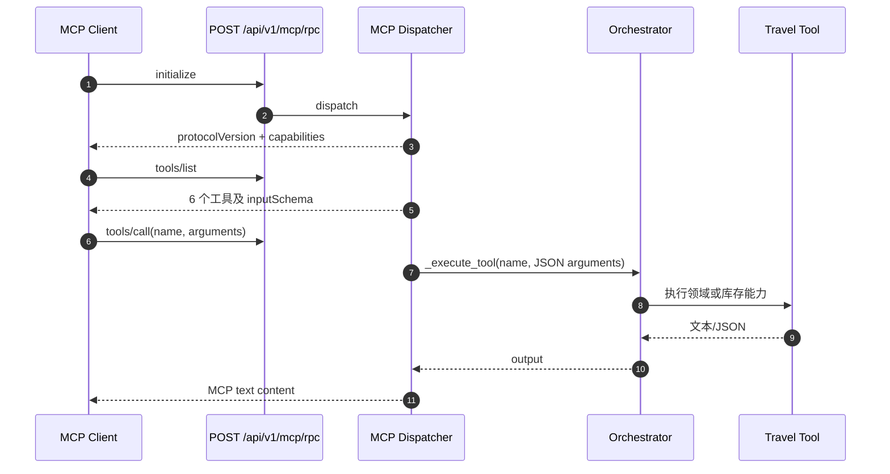

## 7. 工具与外部供应商设计

### 7.1 在线工具清单

| 工具 | 作用 | 主要依赖 |
| --- | --- | --- |
| `plan_travel_itinerary` | 基于结构化需求生成行程草稿和费用预估 | 本地领域模型 |
| `check_travel_policy` | 校验舱位、预算、提前预订和审批条件 | 本地差标规则 |
| `search_flights` | 查询航班候选 | demo / FlyAI / Amadeus |
| `search_hotels` | 查询酒店候选并支持预算、POI 过滤 | demo / FlyAI / Amadeus |
| `search_trains` | 查询高铁/火车候选和余票 | 本地 12306 Skill 或远程 MCP |
| `recommend_travel_options` | 并行查询航班、酒店和火车，排序后形成组合推荐 | 上述 provider |

`app/core/tools/booking.py` 虽然定义了 `create_booking`，但不在上述在线工具白名单和执行分发中；当前在线流程只使用推荐结果派生 `BookingDraft`。

### 7.2 Provider 选择

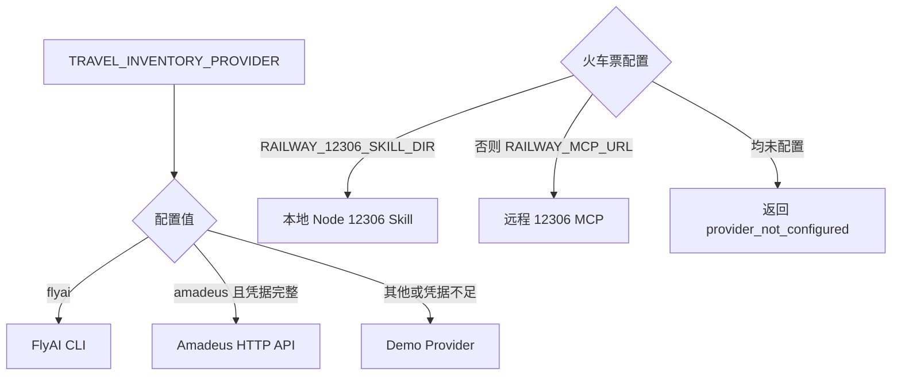

外部查询失败时，系统返回空候选、错误原因和免责声明，不会静默替换为伪造的实时数据。综合推荐通过 `asyncio.gather` 并行查询各类库存，再选取排序后的首选候选；只要返回 `travel_recommendation` 载荷，就会尝试生成草稿，候选为空时草稿中的推荐项可能为空。

## 8. 数据与存储设计

### 8.1 数据关系

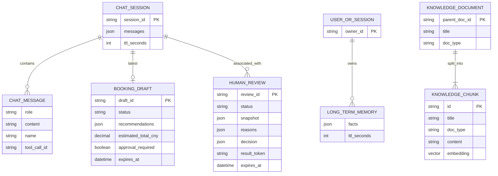

> 该图描述的是业务逻辑对象及其关系，并非当前 PostgreSQL 的物理表结构。当前会话、记忆、草稿和制度问答审核单以 Redis 键保存；知识内容以带重复元数据的 Milvus chunk 保存，并同步维护关键词索引，尚未持久化独立的 `KNOWLEDGE_DOCUMENT` 业务实体。

### 8.2 文档类型与解析能力

当前文档上传入口按文件扩展名识别并处理以下类型。扩展名会先统一转为小写；解析成功后统一转换为纯文本，再进入语义分块、embedding 和双路索引入库。

| 文件类型 | 当前解析方式 | 处理范围与限制 |
| --- | --- | --- |
| `.txt` | 内置文本解析 | 支持 UTF-8、UTF-8 BOM 和 GB18030 等常见编码；按纯文本处理 |
| `.md` | 优先 Unstructured，失败时使用内置文本解析 | 支持 Markdown 文本；无 Unstructured 时仍可按纯文本回退 |
| `.html` / `.htm` | 优先 Unstructured，失败时使用内置 HTMLParser | 去除 script/style，提取正文；无需强制安装 Unstructured |
| `.pdf` | 优先使用 PyMuPDF 执行版面文本、表格和图片信息解析，低文本密度页面按需调用 Tesseract OCR；PyMuPDF 不可用时回退 `pypdf` | 表格转换为 Markdown；保留页码、表格/图片数量、OCR 标记、置信度和 `needs_review` 信息。复杂跨页表格和高密度图文页面仍需持续评测 |
| `.docx` | 优先 Unstructured，失败时使用 `python-docx` | 支持段落和表格文本；无 Unstructured 时保留内置回退路径 |
| `.pptx` | 优先 Unstructured，失败时使用 python-pptx | 提取幻灯片文本及表格；复杂图形文字需另行评测 |
| `.xlsx` | 优先 Unstructured，失败时使用 openpyxl | 按工作表提取单元格文本；不执行公式重算 |

知识库的 `doc_type` 是业务分类而不是文件扩展名，当前允许的取值为 `policy`（制度）、`sop`（流程）、`city_guide`（城市指南）和 `other`（其他）。文件格式支持不等于所有内容都能成功提取；空文档、受密码保护的文件、损坏文件或无可提取文本的文件会在解析阶段返回错误。

独立源代码文件扩展名当前不在上传白名单中；下述“代码”分块约束当前适用于 Markdown 等受支持文档中的代码块。后续若开放 `.py`、`.java`、`.js`、`.ts` 等源代码文件上传，必须复用同一函数/类级分块约束，不得退化为固定长度切分。FAQ 是内容结构而不是文件扩展名，可来自 TXT、Markdown、HTML、DOCX、PDF 或其他受支持载体。

### 8.3 Redis 键设计

| 键模式 | 内容 | TTL |
| --- | --- | --- |
| `chat:session:{session_id}` | 最近最多 `memory_max_messages` 条消息 | 默认 86,400 秒 |
| `memory:long:{user_id或session_id}` | 去重后的长期偏好/事实，最多 20 条 | 会话 TTL 的 30 倍 |
| `booking:draft:{draft_id}` | 完整预订草稿 JSON | 默认 86,400 秒 |
| `booking:session:{session_id}:latest` | 会话最近草稿 ID | 默认 86,400 秒 |
| `human_review:ticket:{review_id}` | 来源快照、转人工原因、状态、决定与独立回执凭据 | 默认 2,592,000 秒（30 天） |
| `human_review:pending` | Sorted Set，score 为审核单过期时间；处理或过期时清理 | 索引自身无 TTL，查询时清理过期项 |
| `knowledge:keyword:chunks` | Redis Hash，保存全文及详细来源元数据（键名可配置） | 无自动 TTL |

预订草稿对象自身的 `expires_at` 为创建后 30 分钟，它表示业务有效期；Redis 键 TTL 表示技术保留期，两者含义不同。

### 8.4 Milvus 集合设计

集合名称为 `travel_knowledge`：

| 字段 | 类型 | 说明 |
| --- | --- | --- |
| `id` | VARCHAR(64)，主键 | 单文档 ID 或 `chk_{parent_doc_id}_{hash}` |
| `title` | VARCHAR(512) | 文档标题 |
| `doc_type` | VARCHAR(32) | `policy`、`sop`、`city_guide` 或 `other` |
| `content` | VARCHAR(65535) | 文档或 chunk 正文 |
| `embedding` | FLOAT_VECTOR(`EMBEDDING_DIMENSIONS`) | 新集合按配置建维度，默认 1536；已有集合不自动迁移 |

索引使用 `IVF_FLAT`，距离度量为 `COSINE`，默认 `nlist=128`，检索时 `nprobe=16`。

### 8.5 文档分块策略

在线长文本和文件入库由 `app/api/routes/documents.py` 调用格式感知分块；`chunk_size` 提供结构分块长度约束，随后统一执行 embedding token 上限检查。`chunk_overlap` 请求参数仅保留接口兼容性，不决定当前重叠策略。

#### 默认 PDF 路径

`RAG_SEMANTIC_PDF_ENABLED=true` 时：

1. 从版面文本、表格及按需 OCR 结果生成结构块，不加字符 overlap。
2. `group_pdf_articles` 按条款组织正文，保留条款号和来源语境；表格保留整表，并通过 `expand_table_rows` 创建带表头及条款语境的行索引。
3. 短条款保持完整。长正文按句子组织单元，对相邻单元计算 Embedding 余弦相似度，在长度约束内选低相似度断点；表格、OCR 图片、FAQ、代码单元不参与该步骤。
4. 默认 `RAG_SEMANTIC_MIN_CHARS=100`、`TARGET_CHARS=180`、`MAX_CHARS=300`；实际长度受请求 `chunk_size` 进一步限制。超长单句先安全拆分，因此并非所有边界都由语义相似度决定。
5. 最后按 `EMBEDDING_CHUNK_MAX_TOKENS` 检查 token 上限，生成稳定 chunk ID 和向量。

该路径对长条款增加额外 embedding 请求；“语义切分”不表示每个句子都调用模型判断，也不保证所有规则适用条件都能被自动恢复。

#### 其他格式与关闭 PDF 语义切分的路径

| 类型 | 当前组织方式与边界 |
| --- | --- |
| Markdown | 按标题路径、段落、列表、表格、代码块组织，元数据携带 `heading_path`；允许的自然语言边界可带 15% 尾部重叠 |
| 普通文本 / HTML / Office | 按段落、句子及识别到的结构单元组织，使用长度约束和允许边界的 15% overlap；不执行相邻句 Embedding 断点算法 |
| PDF（语义开关关闭） | 使用格式感知 PDF 分块及允许边界的 15% overlap |
| FAQ / 代码 / 表格 | 优先保留问答对、代码符号单元及完整表格行；token 超限时执行类型安全的处理，复杂结构仍需专项评测 |

独立源代码文件不在上传白名单中；代码分块目前适用于受支持载体中的代码内容，不能视为已实现所有语言的 AST 解析。所有路径将相同 chunk 同步写入 Milvus 和关键词索引，详细元数据保存在关键词侧并按 ID 回填。修改解析、切块或模型配置后，应删除旧文档并重新入库；评测证据需重标新 chunk ID。

PDF OCR 由低文本密度等条件按需触发，默认依赖 Tesseract 及中文语言包。低置信度片段标记 `needs_review`；当前混合检索在融合后排除此类片段，不将其直接作为可信依据。复杂跨页表格、合并单元格、双栏顺序及图片语义仍属于已知边界。

### 8.6 RAG 检索与排序策略

RAG 对用户问题采用关键词和向量两路独立召回，再进行融合和检索后重排。关键词索引当前以 Redis Hash 持久化完整 chunk，并采用适配中英文混合文本的 BM25 排序；应用启动时会使用已有 Milvus chunk 补齐关键词索引。入库时每个 chunk 以同一个稳定 `chunk_id` 同步写入 Milvus 和关键词索引，保证两路结果可以去重、合并并追踪到同一引用。两路召回使用相同的候选规模，融合后仍限制候选规模，避免将过多片段送入重排模型。

| 阶段 | 策略 | 参数/输出 |
| --- | --- | --- |
| 关键词召回 | 基于 Redis chunk 语料的 BM25 词法检索 | 返回关键词候选 Top-20，并记录关键词侧 rank；当前实现按请求计算 BM25，规模扩大后应迁移到专用倒排引擎 |
| 向量召回 | Query embedding + Milvus COSINE 检索 | 返回向量候选 Top-20，并记录向量侧 rank |
| 双路融合 | Reciprocal Rank Fusion（RRF） | `RRF(d) = Σ 1 / (60 + rank_i(d))`；`k=60`，未出现在某一路的文档该路贡献为 0 |
| 候选截断 | 按 RRF 分数降序 | 保留融合候选 Top-20 |
| 检索后重排 | 启用后使用 `ApiReranker` 调用百炼原生文本排序 API | 输入默认 Top-20，按 API 分数返回默认 Top-5 |
| 每次检索返回 | 取排序结果前缀 | 默认 Top-5；问答补检索可增加去重后的证据片段 |

每次检索的默认排序链路为（各 K 值可配置）：

```text
关键词 Top-20 + 向量 Top-20
    -> RRF 融合（k=60）
    -> 融合候选 Top-20
    -> 可选 API rerank（失败保留 RRF）
    -> 默认 Top-5
```

RRF 只使用各召回通道的名次，不直接比较关键词分数和向量相似度的量纲；rerank 分数只用于最终 Top-5 排序，不替代 RRF 的候选生成职责。最终 Top-5 的原始召回分数、RRF 分数和 rerank 分数应保留在引用及检索 trace 的元数据中，便于评测和问题定位。

当前不部署或下载本地重排模型。`RAG_RERANKER_ENABLED` 默认 false；开启后必须配置 `RAG_RERANKER_API_KEY`、百炼原生 `RAG_RERANKER_URL` 和模型名称（默认 `qwen3.7-text-rerank`）。地址不能使用聊天的 `/compatible-mode/v1`。请求默认超时 30 秒；未配置、API 失败或结果校验失败时按 RRF 顺序返回，记录 `rerank_status=rrf_fallback`。成功为 `api`，未启用为 `disabled`。上述模型名称是代码配置默认值，不代表服务商可用性保证。融合后还会过滤 `metadata.needs_review` 片段。

### 8.7 证据驱动问答、计算与核验

设计以“所问事项需要什么证据”为中心：Top-K 负责提供候选来源，证据包描述需求覆盖和适用条件，草稿绑定事实，核验后决定自动答复或转人工。每次检索仍使用配置的 Top-K；缺失制度依据时默认最多一个补充查询，取回新片段后去重并重建证据。用户缺失条件不能通过检索或模型猜测补齐。

| 阶段 | 输入与输出 | 程序约束 |
| --- | --- | --- |
| 证据整理 | `EvidencePack`：`user_facts`、`policy_facts`、`requirements`、`calculations`、`search_queries` | 用户引文来自原问题；制度引文确实存在于绑定片段；字段严格校验；需求状态为 covered/missing/conflict |
| 计算 | 数值事实 ID 和表达式 → 程序事实记录 `facts` | 受限 AST + Decimal；不使用 eval，不允许调用、属性访问或任意代码；运算引用合法数值事实并保留依赖，公式常量仅允许 0/1/100，不能写入无来源费率或阈值 |
| 草稿 | `AnswerDraft.claims`：结论 ID、类型、事实 ID、需求 ID | 结论类型为 policy/calculation/conditional/limitation；检查数值和需求覆盖，资料不足结论须绑定需求；引用编号由程序生成 |
| 核验 | 原问题、任务范围、草稿、事实及来源 → `AnswerReview` | 模型检查对象、地域、版本、表格行列、前提、例外、否定和推导；程序检查金额与已算结果 |
| 校正 | 失败结论 ID → 替换结论 | 最多一次；保留已通过部分，禁止新增证据、事实和计算；校正后重新核验 |
| 输出 | 完整自动答案、已支持候选子集或失败说明 | 未确认条件、冲突、不完整和处理失败进入独立人工审核；候选不能视为正式结论 |

所有证据模型请求使用 `temperature=0.0` 和 `response_format=json_object`，复用 `OPENAI_*` 配置；不依赖规划器的严格 json_schema 接口。每次请求默认超时 120 秒。证据整理的结构与来源/计算错误有各自的有界修复；草稿与语义校正各自将结构及业务错误合并限制在一次修复机会内。修复不放宽来源、公式或引用约束；上游 API 失败不以无限重试掩盖。

模型逐结论状态为 `supported`、`contradicted`、`insufficient`。当前 `verification_result` 将其映射到公开 `claim_evidence_map` 的 `supported`、`conflict`、`partial`，另含 `claim_id`、`claim`、`kind`、`fact_ids`、`supporting_chunk_ids`、`reason`；原文引文位于证据事实的 sources 中，当前映射不直接输出 evidence_spans。通用模块存在其他核验类型，不应将旧四态分类直接套作主链路模型协议。

三个结果要分开解释：

- `verification.passed`：当前保留结论是否通过核验；支持性不等于所有所问内容都已回答。
- `verification.question_answered`：是否完整回答当前问题；资料不足说明可能正确但仍为 false。
- `answer_status`：`automatic`、`pending_human_review` 或 `review_submission_failed`；是否可作为正式自动答复还需观察该状态及人工决定。

核验不可用、校正失败或次数耗尽时，仅保留此前状态为 supported 的结论；没有通过部分则给受限说明。保留部分时 `answer_mode` 可以继续是 `rag_grounded`、`passed` 可以为 true，但 `question_answered=false` 且仍待人工审核。非 RAG 回复记录 `status=skipped, passed=null, reason=not_applicable`。

`rag_stages` 按 retrieval → 可选 supplemental_retrieval → evidence → draft → verification → 可选 correction/再次 verification → 可选 finalization → final 记录；失败时附 `diagnostics`、`repair_count` 和 `verification.validation_error`。证据诊断日志只记录结构化错误代码、字段、记录 ID 和修复事件；不将原始模型输出或引文写入该诊断日志。模型仍可能漏报或错误核验，正确率需要独立人工评测。

### 8.8 关键领域对象

- `TravelRequest`：员工、职级、出发地、目的地、日期、目的和偏好舱位。
- `Itinerary`：行程段、预估总额和差标警告。
- `TravelPolicy`：职级舱位、城市酒店上限、日补贴、提前预订天数和事前审批金额线。
- `execution_plan`：Planner 经单次调用生成并通过校验的主意图、任务列表、各任务参数与依赖，以及缺失参数和澄清问题。
- `task_results`：多任务执行结果列表，按任务 ID 关联意图、状态、回答、引用、核验、工具轨迹、用量以及各自的草稿和审批结果。
- `policy_constraints`：制度推理节点输出的来源、置信度、备注，以及酒店限额、提前预订、审批阈值、舱位和火车席别等约束。
- `policy_validation`：约束与草稿的逐项检查结果，状态为 `passed`、`needs_review` 或 `failed`，并分别记录通过项、警告和违规项。
- `ApprovalForm`：是否需要人工审批、风险原因和差标警告。
- `BookingDraft`：由工具轨迹中的 `travel_recommendation` 载荷派生，包含推荐交通/酒店、价格快照、确认项、下一步动作和有效期；上游候选失败时允许生成不完整草稿。
- `EvidencePack` / `AnswerDraft` / `AnswerReview`：需求、事实与公式、事实绑定结论、支持性及完整性核验。
- 制度问答审核单：独立 review_id、来源快照、转人工原因、决定与回执凭据，区别于 `ApprovalForm`。
- `ChatResponse`：兼容 Chat Completions 的 `choices`，并扩展表格、引用、计划、任务、证据、核验、人工审核和风险字段。

### 8.9 制度问答人工审核

`prepare_review` 对已进入制度问答的状态检查可观察疑点：需求 missing/conflict、缺失信息、未完整回答、核验未通过、模型要求人工解释，以及检索/草稿/校正/核验处理未完成。转人工不使用模型自报的置信度百分比。

审核快照包含原问题、任务描述、候选答复、草稿、证据及计算、引用、核验和阶段诊断。单任务在最终处理准备材料；子任务在 `_finish_task` 准备，由父图统一持久化一次。客户端收到摘要及独立 `result_token`，不收到内部 `_snapshot` 审核准备字段。存储失败明确返回 submission_failed，不声称已入队。

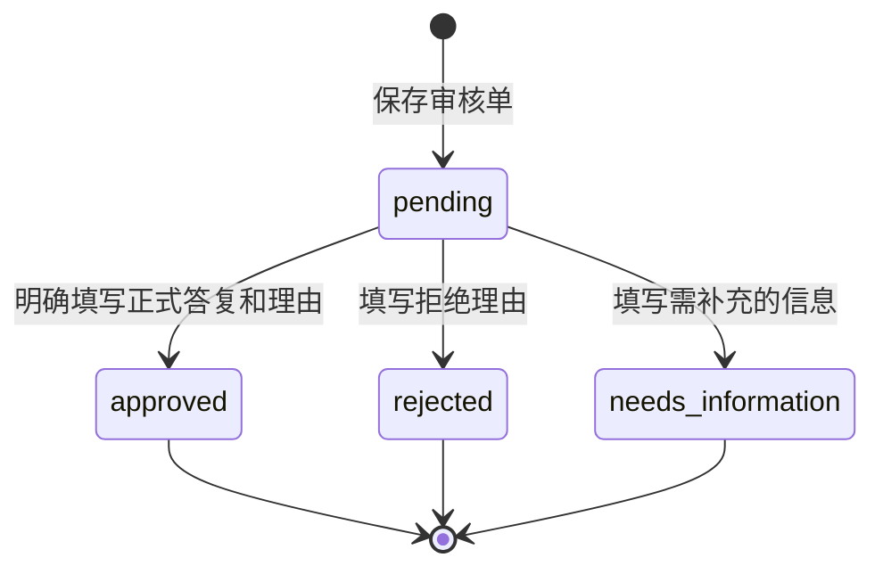

- 审核身份由服务端 Bearer 凭据及 `HUMAN_REVIEW_REVIEWER_NAME` 决定；请求不能自行指定审核人。当前是内部单账号，未接 SSO 或多审核员账号体系。
- 只有 pending 单可提交决定；Redis WATCH 事务保护审核单及当时的会话历史，已处理或并发冲突返回 409，不覆盖决定。决定保留审核单剩余 TTL；默认总保留 30 天，技术过期不代表业务批准。
- approved 必须填写正式答复及理由；模型不改写人工答案。rejected/needs_information 不发布正式答复。回执仅追加到仍存在且未过期的会话，不重建已删除会话。
- 用户查询需 session_id 和单据独立随机回执凭据；审核人员读详情需 Bearer。审核响应设置 no-store。控制台审核凭据只保留页面内存；用户回执凭据保存在浏览器本地，换浏览器或清空存储后可联系审核人员查询。
- 通过、拒绝或补充信息均为终态；补充信息后用户重新提问，可生成新单。审核不自动恢复后继任务，也不产生真实预订或付款。
- 审核材料与制度文档需要审计留存时，应调整 TTL 或接持久化档案。当前聊天历史仍采用项目的内部会话访问方式，回执凭据保护不等同于整个系统已实现租户权限隔离。

## 9. API 设计

| 方法 | 路径 | 说明 | 关键失败条件 |
| --- | --- | --- | --- |
| GET | `/` | 服务入口、文档和控制台链接 | - |
| POST | `/api/v1/chat` | 非流式 JSON 或 SSE 对话；未提供会话 ID 时生成 UUID | 未配置聊天密钥 503；请求校验失败 422；模型/编排异常 |
| GET | `/api/v1/health` | 依赖探测和模型密钥配置状态 | 未初始化或探测失败返回 degraded 内容；HTTP 仍为 200 |
| GET | `/api/v1/sessions` | 扫描并列出会话 | Redis 不可用时 503 |
| GET | `/api/v1/sessions/{id}` | 查询会话历史 | Redis 不可用 503；不存在 404 |
| DELETE | `/api/v1/sessions/{id}` | 删除会话 | Redis 不可用时 503 |
| POST | `/api/v1/documents/ingest` | 单段文本向量与关键词双路入库 | 模型密钥或任一写入依赖不可用 503 |
| POST | `/api/v1/documents/ingest-long` | 长文本结构分块入库 | 配置/依赖缺失 503；参数不合法 422；写入失败 500 |
| POST | `/api/v1/documents/upload` | 上传 txt/md/html/htm/pdf/docx/pptx/xlsx 并入库；Office 与网页格式优先使用 Unstructured | 格式不支持 415；解析失败 422 |
| GET | `/api/v1/documents` | 列出知识 chunk | Milvus 不可用 503 |
| GET | `/api/v1/documents/search` | 文本混合检索（关键词 + 向量，RRF 后 rerank） | 任一检索通道不可用或检索失败 |
| DELETE | `/api/v1/documents/{id}` | 按父文档或 chunk ID 删除 | Milvus 不可用 503 |
| POST | `/api/v1/documents/batch-delete` | 批量删除文档 | 任一删除异常时 500 |
| DELETE | `/api/v1/documents?title=...` | 按标题删除 | Milvus 不可用 503 |
| POST | `/api/v1/mcp/rpc` | MCP 初始化、工具、资源调用 | JSON-RPC error 响应 |
| GET | `/api/v1/human-reviews` | 默认最多 50 个待审核摘要，limit 上限 100；需 Bearer | 审核凭据未配置/存储不可用 503；凭据无效 401 |
| GET | `/api/v1/human-reviews/{review_id}` | 审核详情和来源快照，排除回执凭据；需 Bearer | 401/503；单据不存在或过期 404 |
| POST | `/api/v1/human-reviews/{review_id}/decision` | 提交 approved/rejected/needs_information、final_answer、notes；需 Bearer | 内容不合法 422；已处理/并发冲突 409；404/401/503 |
| GET | `/api/v1/human-reviews/{review_id}/result?session_id=...` | 用户审核回执，需 X-Review-Result-Token 请求头 | 会话或凭据不匹配/单据不存在 404；存储不可用 503 |

非流式 `/chat` 返回 OpenAI 风格基础结构，并增加：

- `tables`：从执行计划、制度约束、合规校验、行程文本、库存 JSON、Markdown 表格和预订草稿转换出的结构化表格。
- `citations`：RAG 命中的标题、类型、正文片段和相似度。
- `execution_plan`：统一意图与规划节点生成的已校验任务计划；规划失败或需要澄清时保留对应状态，不生成关键词兜底任务。
- `task_results`：包含 `task_id`、`intent`、`request`、`status`、`answer`、`citations`、`tool_trace`、`verification`、`claim_evidence_map`、`booking_draft`、`approval_form`、`policy_constraints`、`policy_validation`、`risk_level` 和 `usage`，另含 `rag_evidence`、`rag_stages`、`human_review`；保留每个任务的结果及证据归属。
- `route`：`single_task`、`multi_task` 或 `clarification`，说明顶层处理分支；来自编排器内部 `metadata.route`。
- `intent`：本次请求的主意图；实际任务路由以 `tasks[].intent` 为准。
- `policy_constraints`：制度资料中抽取并合并后的结构化约束及其来源、置信度。
- `policy_validation`：自动合规校验状态、检查项、通过项、警告和违规项。
- `approval_form`、`booking_draft`：单任务的人工审批和预订确认数据；多任务时顶层为空，读取对应 `task_results` 中的结果。
- `trace`、`risk_level`、`answer_mode`、`verification`、`claim_evidence_map`：解释、治理、逐条事实-证据对齐和核验信息。
- `rag_evidence`、`rag_stages`：证据包和事实记录、阶段输出及诊断；多任务时读取各自的 `task_results`。
- `human_reviews`：本次响应关联的审核摘要，包括单据 ID、原因、任务 ID、时间和用户独立 `result_token`；失败项没有可查询单据 ID。
- `answer_status`：automatic / pending_human_review / review_submission_failed。该状态独立于 answer_mode 和 verification.passed。
- `session_id`：API 自动生成或复用调用方指定的会话标识；它不是身份凭据。

SSE 仍在工作流完成后按字符回放；LangGraph 的 `done` 事件附带 `session_id`、`human_reviews`、`answer_status`，不会实时推送后续人工决定。

Web 控制台展示任务结果、引用、证据核验和旅行审批；左侧“人工审核”供持有审核凭据的人员读取队列及提交决定，聊天右侧“人工审核”供用户手动刷新回执。正式人工答复使用审核人员明确填写的文本，原始引用作为核对材料，当前没有对人工改写答案再进行自动语义核验。

## 10. 部署架构

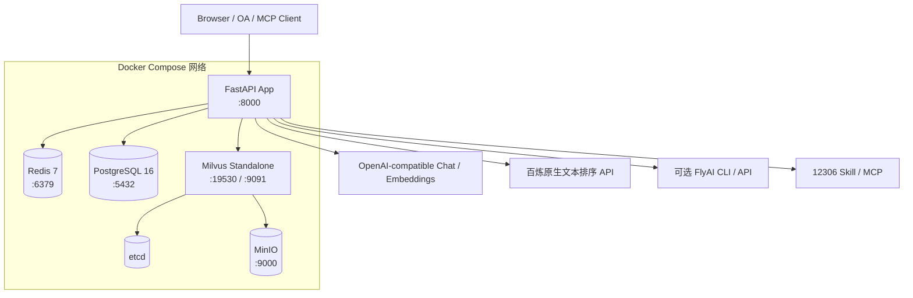

应用镜像安装 Python 依赖、Node.js、npm、Tesseract 和中文 OCR 包；FlyAI CLI 仅在构建参数 `INSTALL_FLYAI_CLI=1` 时安装，Unstructured 增强解析仅在 `INSTALL_OPTIONAL_DEPS=1` 时安装。`external/12306` 可写挂载，FlyAI skill 只读挂载。Compose 等待 PostgreSQL、Redis 和 Milvus 均健康后创建应用；应用运行时仍允许依赖降级。

### 10.1 启动与关闭

1. 配置结构化日志和 OpenTelemetry TracerProvider。
2. 尝试连接 Redis；失败置空，健康探测会显示不可用。
3. 创建 PostgreSQL 异步引擎；健康检查实际执行 SELECT 1。
4. 连接 Milvus，缺少集合时按配置维度创建 schema 和索引。
5. 创建 Redis 关键词索引；从已有 Milvus 文档补齐索引中缺失的 chunk（当前扫描上限 10,000），不覆盖已有详细元数据。
6. 创建 HybridRAGRetriever 和 ApiReranker，根据配置选择 LangGraph 或 legacy 编排器。

关闭释放 Redis 与 PostgreSQL 资源；Milvus 没有显式断开逻辑。审核服务直接使用应用 Redis 客户端，配置审核凭据不增加独立数据库。

### 10.2 配置加载与实际部署边界

宿主机 Python 在仓库根目录运行时由 Settings 加载 `.env`。首次部署可从 `.env.example` 创建配置，分别填写聊天、Embedding、rerank 密钥/地址；人工审核使用独立 `HUMAN_REVIEW_API_TOKEN`。修改配置后重新启动 Python 进程。

```bash
# 宿主机运行应用；先启动基础设施
docker compose up -d postgres redis etcd minio milvus-standalone
python -m venv .venv
source .venv/bin/activate
pip install -r requirements.txt
uvicorn app.main:app --host 0.0.0.0 --port 8000
```

**当前 Docker Compose 存在配置传递缺口：**它只将 environment 中显式列出的变量传入 app，未设置 env_file，镜像也不复制根目录 `.env`。因此宿主机 `.env` 并不意味着所有字段进入容器。当前缺少 `HUMAN_REVIEW_*`、`RAG_RERANKER_API_KEY/URL`、`PLANNER_*`、`RAG_EVIDENCE_*`、`RAG_SEMANTIC_*` 以及部分任务/记忆参数的传递；重排模型的 Compose 回退默认值仍是旧本地模型名称。

这会使容器审核入口未配置、重排回退 RRF，并可能使不支持 json_schema 的聊天服务规划失败。需要部署者补齐这些字段或合适的 env_file，并保留容器内 Redis/PG/Milvus 地址覆盖，再重新创建容器。此处记录当前实现缺口，本次文档更新没有修改 Compose。健康检查只确认模型配置存在，不验证 API 网络、余额或具体模型可用性；审核凭据配置也未列入健康检查。

## 11. 非功能设计

### 11.1 可用性与降级

- Redis 失败：会话、记忆、草稿和审核存储不可用；非依赖检索的聊天可继续。需要人工的制度问答返回明确的审核提交失败，审核接口返回 503。
- Milvus/关键词索引或检索失败：文档接口返回依赖错误；制度问答直接给受限说明，标记 llm_fallback 和 medium 风险并尝试转人工，不追加模型猜测。
- rerank API 失败：保留 RRF 顺序并记录 rrf_fallback；不绕过双路检索。
- 证据、草稿、校正或核验失败：记录诊断，只保留已有支持部分；资料不完整或处理未完成转人工。模型账户返回 402 时提示检查余额/计费状态。
- PostgreSQL 失败：健康状态 degraded，当前聊天业务不依赖其业务表。
- 外部库存失败：返回空候选、错误与免责声明，不伪造实时数据；旅行候选最多按配置重试，仍失败则进入旅行审批提示。
- LangGraph 导入失败：可回退 legacy，但证据驱动与审核单生成能力不等价，应检查启动日志和响应中的编排信息。
- LLM 连续失败：共享 LLMService 熔断器按配置切换 closed/open/half-open；ReAct 轮数有上限。
- Planner 超时、Schema/依赖错误或缺参：澄清，不追加第二次规划调用，不执行猜测任务。
- 多任务失败或超时：保留已完成结果，失败/待审核前置任务阻断后继；失败制度查询另准备人工材料。
- 旅行制度约束抽取失败：空约束并标记来源，合规结果需复核，不能假定符合制度。

健康接口将未初始化的 Redis/PG/Milvus/关键词索引视为不可用，综合返回 ok/degraded，HTTP 为 200。聊天和 Embedding 密钥检查只检查非空；启用重排时还检查其 key/URL，均不做实时模型调用。Docker HEALTHCHECK 目前只检查 HTTP 可达，不能代替 readiness 或业务可用性判断。

### 11.2 一致性与幂等性

- 会话消息按首尾重叠去重；长文档 chunk ID 使用父 ID、序号和内容哈希稳定生成。切块变化必须重标评测标签。
- Milvus 写入后 flush，再更新关键词索引；跨存储入库不是事务，部分失败需核查和补偿；相同父 ID 重建前应删除旧数据。
- 审核单和待审核索引在 Redis 事务中创建；决定使用 WATCH 乐观并发控制，禁止覆盖终态，保留剩余 TTL。审核与会话历史同时更新，但整个系统的其他聊天写入并未统一使用同一事务协议。
- 审核单是决定的规范记录；会话不存在/过期时只保存审核决定，不恢复历史。清空 Redis 数据卷会丢失审核材料，不是长期档案存储。

### 11.3 性能

- 上下文按消息数裁剪，长历史可先摘要；所有通过护栏的请求执行一次联合意图/规划调用。
- 最多 8 个任务，默认并发 3 个独立只读任务；规划 30 秒，policy/rag 子任务 360 秒，其他任务 120 秒。任务超时仅约束多任务执行器，并非整个单任务 HTTP 请求总超时。
- 无补检索/修复/校正时，证据问答需整理、草稿、核验至少三次模型调用，另有规划等开销。每次证据模型请求最多 120 秒，补检索和修复会增加延迟/token；客户端超时需覆盖完整路径。
- PDF 长条款语义切分会额外调用 Embedding；长度配置不等于所有条款都拆分。检索并行执行 BM25 和 Milvus 向量通道，可选重排增加远端 API 等待。
- Redis BM25 当前按请求计算，队列按上限返回并清理过期项；大规模知识库和审核流量应分别评测容量。Milvus IVF_FLAT 参数及 Top-K 需按测试集调整。
- 旅行综合推荐内部并行查库存；供应商并发预算与任务并发需一起考虑。SSE 仍完成后回放，不能降低首字节等待。

### 11.4 安全与合规

当前控制：

- Pydantic 检查请求/工具参数、任务计划及证据结构，工具和业务分支有白名单。
- 输入护栏及文档信任边界提示将资料指令作为数据；不能视为完全抵御所有提示注入。
- 制度事实绑定原文引文，用户事实绑定原问题；受限 AST/Decimal 计算，结论与已验证事实/计算对齐，不放宽来源约束以获得答案。
- 未通过结论不作为最终制度答案；转人工候选有明确标记，核验通过不替代业务正确率和人工决定。
- 审核入口需独立 Bearer，服务端记录审核身份，禁止重复覆盖；用户回执需随机独立凭据且响应 no-store。默认保留 30 天。
- 当前在线流程不自动下单或付款；旅行审批与制度问答审核分别记录。

生产部署仍需统一认证、企业租户隔离、RBAC、真实审核员账号、session/user 服务端身份绑定；当前审核共享凭据只适合内部控制台。现有聊天历史和 MCP 接口未因此获得完整访问控制。另需 CORS 白名单、限流、上传限制与恶意文件检测、PII 脱敏、Secret Manager、审计导出及长期保留策略。浏览器本地用户回执凭据属于访问能力，需遵守终端与账号管理要求。

### 11.5 可观测性与质量量化

- 结构化日志、基础 TraceProvider 和节点 trace 已存在，尚未配置集中 exporter、指标后端与统一 request ID。
- 单元/路由测试覆盖任务路由、依赖阻断、证据校验与修复、审核权限/回执/冲突、流式 done 状态和评分口径；工作流测试通过不等同于新一轮模型正确率测量。
- `evals/build_rag_cases.py` 生成候选题及复核表，`apply_rag_review.py` 只根据明确决定产出获批题集。现有 45 题来源于单份真实差旅 PDF，是开发试点，不代表跨企业生产泛化。
- `run_rag_eval.py` 记录 Hit/MRR/Precision/Recall、证据组覆盖、检索/问答延迟、usage、阶段输出，以及转人工率、提交率、自动答案关键词代理指标。关键词命中与引用命中不是语义正确率。
- `answer_review.py` 根据明确 0/1 人工标签评分；当前自动 answer_accuracy/grounded/citation/negative_abstention 指标排除转人工题，空标签不计分母。新增 review_appropriateness_rate、post_review_outcome_accuracy、review_duration_mean_seconds；必须同时报告自动处理覆盖、转人工率、标签覆盖及分母。
- 转人工不自动算答对或答错；自动答案正确率分母变化，不能直接对比历史全部题目的正确率。审核后结果需要真实人工决定及复核标签，不能把模拟流程测试作为业务审批或准确率证据。
- 每次比较需记录代码、题集、知识库快照、模型配置、延迟/token 和复核范围；本次设计文档更新不重测或改写历史分数。详细操作见 `evals/README.md`，人工审核评分字段以脚本为准。

## 12. 关键配置

| 配置组 | 代表变量 | 作用 |
| --- | --- | --- |
| Chat LLM | `OPENAI_API_KEY`、`OPENAI_BASE_URL`、`OPENAI_MODEL` | 对话、工具选择、摘要、反思 |
| Embedding | `EMBEDDING_API_KEY`、`EMBEDDING_BASE_URL`、`EMBEDDING_MODEL`、`EMBEDDING_DIMENSIONS` | 文档和查询向量化 |
| 存储 | `REDIS_URL`、`DATABASE_URL`、`MILVUS_HOST`、`MILVUS_PORT`、`KEYWORD_INDEX_REDIS_KEY` | 会话、健康探测、向量知识库和关键词索引 |
| RAG | `RAG_KEYWORD_TOP_K`、`RAG_VECTOR_TOP_K`、`RAG_RRF_K`、`RAG_FUSED_TOP_K`、`RAG_FINAL_TOP_K`、`RAG_RERANKER_*` | 双路召回、RRF 融合、候选截断与远端 API 重排（默认关闭） |
| 证据问答 | `RAG_EVIDENCE_TIMEOUT_SECONDS`、`RAG_EVIDENCE_TASK_TIMEOUT_SECONDS`、`RAG_EVIDENCE_MAX_SUPPLEMENTAL_QUERIES`、`RAG_EVIDENCE_CHUNK_MAX_CHARS` | 默认每次调用 120 秒、policy/rag 子任务 360 秒、最多一个补充查询、证据片段最多 8000 字符 |
| PDF 语义切分 | `RAG_SEMANTIC_PDF_ENABLED`、`RAG_SEMANTIC_MIN_CHARS`、`RAG_SEMANTIC_TARGET_CHARS`、`RAG_SEMANTIC_MAX_CHARS` | 默认启用、100/180/300 字符长度约束，长正文按相邻句相似度切分 |
| 人工审核 | `HUMAN_REVIEW_API_TOKEN`、`HUMAN_REVIEW_REVIEWER_NAME`、`HUMAN_REVIEW_TTL_SECONDS` | 独立审核凭据、服务端账号名称、默认 30 天保留期；凭据空时审核入口 503 |
| 工作流 | `AGENT_ORCHESTRATOR_BACKEND`、`MAX_REACT_ITERATIONS`、`TRAVEL_VALIDATION_MAX_RETRIES` | 编排后端、单轮 ReAct 循环上限和候选合规重试次数（默认 1）；变量名为兼容现有部署保留 `AGENT_` 前缀 |
| 意图与任务规划 | `PLANNER_RESPONSE_FORMAT`、`PLANNER_TIMEOUT_SECONDS` | 默认 `json_schema` 严格输出和 30 秒规划超时；不支持 Schema 的模型供应商可显式使用 `json_object`，仍须通过本地校验 |
| 多任务调度 | `TASK_MAX_CONCURRENCY`、`TASK_TIMEOUT_SECONDS` | 默认并发 3 个独立只读任务，普通子任务超时 120 秒，policy/rag 使用证据任务超时；任务数量上限为 Schema 固定的 8 个 |
| 记忆 | `MEMORY_WINDOW_SIZE`、`MEMORY_SUMMARY_THRESHOLD`、`MEMORY_MAX_MESSAGES`、`MEMORY_SESSION_TTL_SECONDS` | 上下文窗口、摘要和持久化 |
| 航班酒店 | `TRAVEL_INVENTORY_PROVIDER`、`FLYAI_*`、`AMADEUS_*` | provider 与凭据 |
| 火车票 | `RAILWAY_12306_SKILL_DIR`、`RAILWAY_MCP_URL`、`RAILWAY_*_TIMEOUT_S` | 本地 Skill 或远程 MCP |
| 熔断 | `CIRCUIT_BREAKER_*` | 聊天模型故障隔离与恢复 |

新建 Milvus 集合使用 `EMBEDDING_DIMENSIONS`（默认 1536），实际模型输出须与现有集合一致。仅修改配置不会迁移已有集合；需重建或使用匹配集合。配置加载和容器缺口见 10.2；表中变量存在不代表当前 Compose 已全部传递。

## 13. 已知技术边界与演进建议

| 优先级 | 当前边界 | 建议 |
| --- | --- | --- |
| P0 | 整体缺乏统一认证和租户隔离；制度问答审核仅有内部共享凭据 | 在公网或企业集成前加入 OIDC/JWT、RBAC、租户维度存储键和审计日志 |
| P0 | 预订草稿尚未形成受控状态机 | 建立 draft -> approved -> held -> confirmed/cancelled 状态机，所有外部副作用使用幂等键 |
| P1 | PostgreSQL 未承载业务数据 | 持久化审批、行程、预订、审计事件；Redis 只保留缓存和短期会话 |
| P1 | SSE 为完成后字符回放 | 设计工作流事件协议，实时发送模型 delta、tool_call、tool_result 和 done |
| P1 | 差标规则为代码内默认值 | 将政策版本化并按企业、职级、城市和生效日期管理；计算结果保留 policy_version |
| P1 | 格式感知 ETL 已接入；PDF 默认条款聚合、Embedding 断点和表格行索引，其他允许边界使用 15% overlap | 增加独立源代码文件白名单及多语言 AST 分块；针对超长代码、复杂表格和非标准 FAQ 建立人工复核与专项评测 |
| P1 | PDF 已接入 PyMuPDF 表格解析、图片统计和低文本密度页面按需 OCR，并保留 OCR 置信度与 `needs_review` | 加强跨页表格、合并单元格、双栏阅读顺序和图片区域级 OCR；用真实制度 PDF 建立解析准确率基线 |
| P1 | 在线 RAG 已接入 Redis BM25 关键词召回、Milvus 向量召回、RRF（`k=60`）、候选 Top-20 和可选远端 rerank Top-5 | 增加租户/doc_type/生效日期过滤、最低相关性阈值、API 预算与大规模关键词索引方案，持续评估 Redis 全量 BM25 的容量边界 |
| P1 | 已接入证据包、来源和计算校验、语义核验、有界修复及制度问答人工审核；语义判断仍可能误报/漏报 | 通过 NLI/LLM-as-judge 与人工标注集提升否定、条件范围、跨句证据和证据冲突的识别准确率 |
| P1 | 审核单仅存 Redis，单账号、无后继任务自动恢复 | 接企业身份、长期档案和受控任务恢复；保留审核与执行的权限边界 |
| P1 | Compose 未传递部分新增配置且重排模型回退默认值过时 | 对齐配置传递与应用默认值，加入启动配置契约检查 |
| P1 | 已合并意图与规划，通过 Schema 校验后的业务任务与依赖驱动单/多任务分支；缺参或非法计划转澄清 | 建立人工标注的复合请求评测集，衡量任务遗漏、过度拆分、槽位准确率和依赖正确率，再评估经过验证的简单请求快车道 |
| P1 | 多任务结果以隔离状态执行并逐项汇总，只有独立只读任务并行；legacy 回退不具备同等调度保证 | 增加持久化任务状态和中断恢复，统一供应商级并发预算；在有权限及幂等保障后再扩展有外部副作用的业务任务 |
| P1 | 制度约束抽取与校验规则覆盖有限 | 建立版本化约束 schema、单位归一化、城市/职级作用域和冲突解决策略 |
| P1 | 文档写入无事务和任务队列 | 对大文档采用异步任务、状态表、重试与补偿删除 |
| P2 | 部分 `app/core`、`app/infrastructure` 能力与在线链路重复 | 明确唯一编排、LLM、Milvus 抽象，逐步收敛重复实现 |
| P2 | 健康接口返回 200/degraded；模型只检查配置，Docker 探针仅确认 HTTP 可达 | 增加 readiness/liveness 分工及受限主动连通性探测 |
| P2 | 仅有进程内 TraceProvider | 配置 OTLP exporter、指标、日志关联和 SLO 告警 |

## 14. 代码导航

```text
app/
├── main.py                         # 应用工厂与生命周期
├── config.py                       # 环境配置
├── api/routes/                     # REST、SSE、MCP；human_reviews.py 为审核接口
├── agent/
│   ├── langgraph_orchestrator.py   # 默认主编排图
│   └── orchestrator.py             # 共享能力与 legacy 编排器
├── core/
│   ├── agent/                      # 通用 Planner/ReAct/Reflection
│   ├── intent/                     # 可复用意图组件，非主图分类入口
│   ├── memory/                     # 通用记忆组件
│   ├── rag/                        # 混合检索、ApiReranker、evidence.py 校验与计算
│   └── tools/                      # 工具注册、库存、MCP 客户端
├── domain/
│   ├── task_plan.py                # 合并意图/任务计划模型与严格 JSON Schema
│   └── travel/                     # 行程和差标领域模型
├── etl/                            # 文档分块与入库管线
├── services/
│   ├── evidence_qa.py              # 结构化证据、草稿、语义核验与修复
│   ├── human_review.py             # Redis 审核单、决定、回执
│   └── ...                         # LLM、Embedding、Milvus 等
├── infrastructure/                 # 基础设施抽象与可观测性
└── static/                         # 管理与演示控制台

tests/                              # 单元和路由测试，含计划 Schema/任务调度/制度/评测指标
evals/                              # RAG 案例生成、人工复核、精选集和在线评测
external/                           # 12306、FlyAI 外部能力包
docker-compose.yml                  # 本地完整依赖拓扑
Dockerfile                          # 应用镜像
```

## 15. 设计结论

当前系统以 FastAPI 接入、LangGraph 编排、领域规则与库存工具执行、Redis/Milvus/关键词索引保存上下文与知识。一次 Planner 输出经本地校验的任务计划，独立只读任务有界并行，依赖任务按前置结果执行，最终按任务保留来源、状态和治理信息。

制度问答保留混合检索和默认 Top-K，在候选资料上整理需求、用户条件、制度事实及公式；必要时有界补检索，程序验证来源并计算，模型生成事实绑定的结论后再进行语义及数值核验。结论校正和结构修复有明确次数上限；不确定、未完整回答或处理未完成时，候选资料进入独立人工审核，由授权审核人员发布正式答复。人工审核并不消除模型漏报和政策解释风险，也不自动推进预订任务。

PDF 默认按条款及表格组织，长条款使用相邻句 Embedding 相似度断点；重排通过百炼原生 API 完成，当前没有本地重排模型部署。旅行分支仍以制度约束、工具候选、合规重试和旅行审批/草稿为中心；真实下单和付款未接入在线链路。

生产演进优先补齐 Compose 配置契约、统一身份与租户隔离、可审计的多人审核及持久化档案、审批/预订状态机、真正流式事件、政策版本治理和冻结测试集量化。

## 16. 修订记录

| 版本 | 日期 | 主要变更 |
| --- | --- | --- |
| 1.8 | 2026-10-09 | 按 a741cb9 同步证据驱动问答、受限计算与修复、补充检索、独立人工审核与评分口径；更新 PDF Embedding 切块、百炼 API 重排、解析回退、健康与维度说明；记录当前 Compose 配置传递缺口 |
| 1.7 | 2026-09-28 | 合并意图识别与任务规划为单次结构化模型调用；增加计划校验、单/多任务分流、依赖调度、逐任务结果和统一持久化；明确规划失败与缺参澄清，不再使用关键词兜底计划 |
| 1.6 | 2026-09-22 | 双路混合检索、RRF（`k=60`）、Top-20 rerank 至 Top-5、格式感知语义分块、PDF/OCR 以及事实核验与自校正 |
